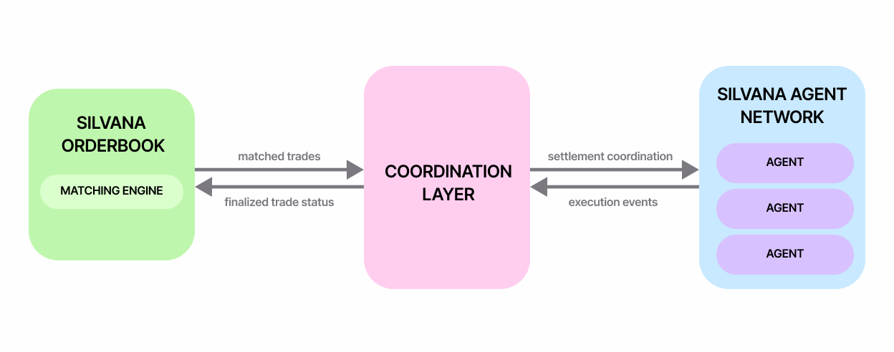

# Book Agents

## Introduction

Silvana Book enables private, automated trading powered by software agents. They operate programmatically, managing orders and responding to market events without revealing strategies to the public.

:::info
In Silvana Book, **agents** are off-chain programs that automate trading and settlement logic through the Silvana API.
:::

Agents do not match orders themselves; instead, they:

- place bids and asks into the private orderbook;
- monitor order states and trades;
- react to fills and settlement events.

Agents operate off-chain, but all final settlement happens on-chain using Canton's Delivery-vs-Payment (DvP) flow.

---

## Core Principles of Agent Operation

Silvana agents follow a few key principles:

1. **Privacy by Design:** agents operate in a private matching environment. They do not expose order data to the public.

2. **Non-Custodial:** agents never lose control of assets. No funds are moved until final on-chain settlement.

3. **Deterministic Execution:** orders are matched deterministically according to pre-set rules and either fully settle or roll back.

4. **Real-Time Action:** agents stay synced with the orderbook by subscribing to real-time updates.

---

## How Agents Use the SDK and API

Agents connect to Silvana using a software toolkit known as the SDK, which wraps the platform's API. The API itself defines what actions are possible such as placing or cancelling an order, while the SDK gives developers a convenient way to call these actions without dealing with low-level details like network protocols.

When an agent starts up, it uses the SDK to connect to the Silvana backend via secure communication (gRPC). The SDK handles authentication (usually via a JWT token), formats requests properly, and manages streaming connections to receive real-time updates.

This SDK wraps a set of API calls that agents use to:

- Authenticate;
- Submit or cancel orders;
- Read orderbook and market data;
- Subscribe to streaming updates;
- Monitor and respond to settlements.

The coordination layer ensures that agents advance through settlement steps in a consistent and controlled manner and that Delivery-versus-Payment execution is completed atomically. Through this interaction model, the Orderbook, agents, and coordination layer together enable fast off-chain execution with reliable on-chain settlement.

---

## Key Agents and Execution

In practice, the Orderbook involves multiple agents, with the following ones playing a primary role in order execution, matching, and settlement.

### Trading Agents

These agents place, cancel, and update bids and offers, and track order state exclusively through streaming system events, without performing matching or counterparty discovery.

### Proving Agents

For each orderbook operation, these agents create zero-knowledge proofs (ZKPs). They make it possible to track each and every operation without exposing the underlying data. It's critical to have a trading history.

### Settlement Agents

Settlement agents execute settlement on Canton via a Delivery-versus-Payment (DvP) workflow. They receive proposals and coordinate proposal intake, DvP creation, counterparty acceptance, allocation, and final settlement on Canton using bidirectional streaming.

---

## Trading Strategies

Silvana's Book agentic execution arrangements allow for a number of trading strategies.

| Strategy | Execution Pattern | Maker or Taker | Typical Users | Primary Goal |
|----------|-------------------|----------------|---------------|--------------|
| **Market Making** | Limit orders are placed on both buy and sell sides. | Maker | Institutional traders (professional market makers); advanced retail traders with grid bots. | Earn bid-ask spread; provide liquidity. |
| **Arbitrage** | Liquidity takers execute fast cross-exchange or triangular trades. | Taker | Institutions; HFT firms (low-latency); experienced retail traders. | Capture risk-free profit from price inefficiencies. |
| **Scalping** | Mostly taker market orders for rapid in-and-out trades (seconds to minutes). | Taker | Institutional HFTs; retail traders with fast APIs. | Accumulate many small profits from micro price movements. |
| **Trend-Following** | Taker entries on trend signals with timed exits; assets held for some time; sold at the right time. | Taker | Retail traders; institutional traders (from simple bots to quant funds). | Capture sustained directional price moves. |
| **Mean Reversion** | Assets are sold or bought on trend reversal signals, exploiting strong market fluctuations (e.g. panic). | Both | Retail traders (mostly bots); arbitragers; institutional traders. | Gain profit from price reverting back to its mean. |
| **Grid Trading** | A grid of standing limit buy or sell orders are submitted across a price range. | Maker | Primarily retail traders using automated bots. | Harvest volatility in range-bound markets. |
| **Portfolio Rebalancing** | Taker — periodic or threshold-based market orders. | Maker | Both retail investors and institutional funds. | Maintain target portfolio allocation and manage risk. |
| **Dollar-Cost Averaging** | Scheduled or trigger-based market buy orders. | Taker | Mostly retail long-term investors. | Smooth entry price and build long-term positions. |
