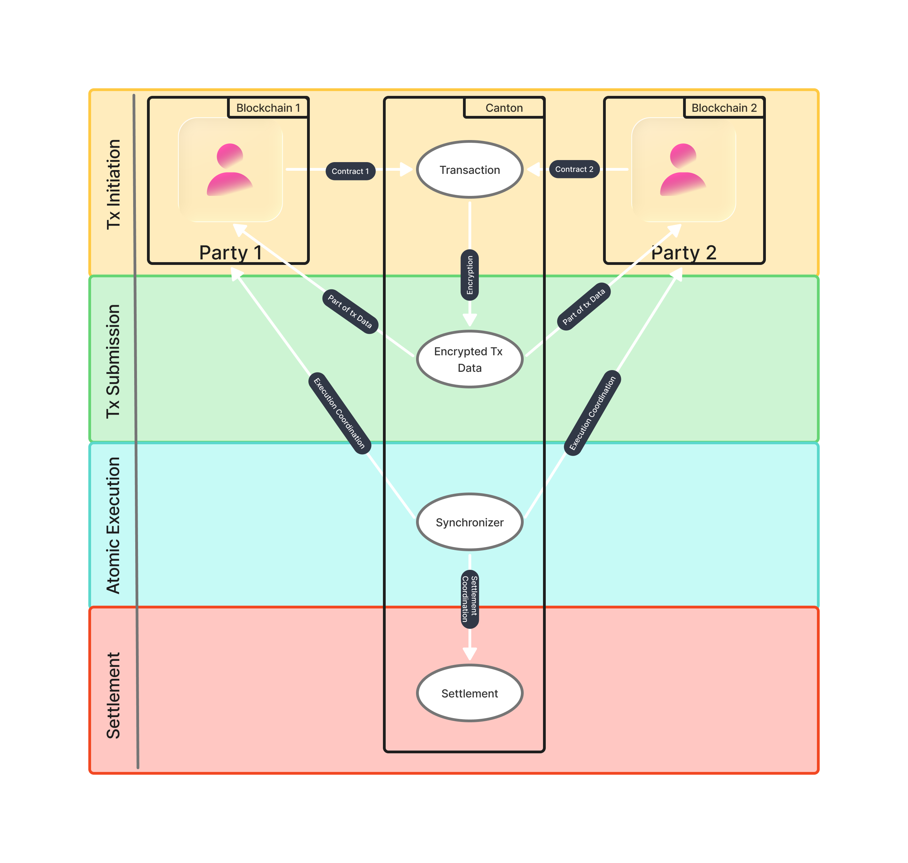

# Orderflow

A typical DvP transaction on Canton follows this secure flow:

### 1. Transaction Initiation

Participants create DAML contracts representing the asset transfer and payment that include conditions to be met for settlement. Each participant signs their part of the transaction.

### 2. Privacy-Preserving Submission

Transaction data is encrypted before submission. Only relevant sub-transactions are shared with each participant. Sequencer receives encrypted messages for ordering.

### 3. Atomic Execution

Global Synchronizer coordinates across blockchains. Settlement utility ensures both delivery and payment occur atomically.

### 4. Finality and Settlement

Validators verify transaction correctness. Settlement is recorded on all relevant blockchains. Participants receive confirmation of completed settlement.

:::tip
If any party fails to meet the contractual obligations and fulful their part of the contract, settlement fails, and the transaction rolls back. No assets move from one account to another.
:::

