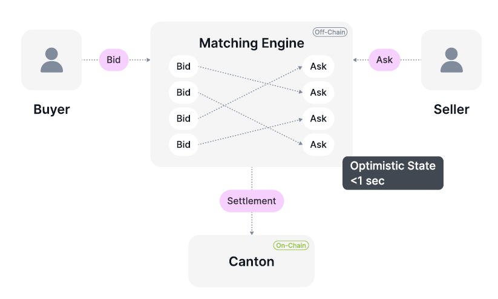

# Meet Silvana Book
n
## Overview
**Silvana Book** is a private order book designed for high-performance trading on **Canton**, combining ultra-fast off-chain order matching with secure, atomic on-chain settlement. It enables market participants to trade with full asset control, strong privacy guarantees, and deterministic execution, without exposing orders or strategies to the public network Silvana Book.

## Solution and Core Concepts
The system separates **execution** from **settlement**:

- **Order matching** happens **off-chain** inside a private matching engine.

- Bids and Asks match automatically via agents. Upon matching, an optimistic state is generated. From now on, the transaction is deemed irreversible.

- **Settlement** follows up on-chain on Canton, using a **Delivery-versus-Payment (DVP)** flow, according to which assets are swapped simultaneously when both parties fulfil their obligations.

:::tip Note
Assets never leave a party’s wallet, which effectively means parties retain directcontrol of their assets until a transaction is finalized.
::: 

This design achieves sub-second execution latency while preserving on-chain security and finality.

:::tip Note
In case any party should fail to fulfil contractual obligations, such transaction is not finalized and rolls back.
::: 

## Basic Principles
### Privacy by Default
All order matching runs in a private environment. Trading activity, balances, and strategies are not visible to the public, preventing information leakage and external interference Silvana Book. This is particularly critical for enterprises and big companies willing to keep their operations a secret to avoid frontrunning, market fluctiations or third-party abitrage or MEV-seekers' attempts.

### Full Asset Control
No assets are escrowed during matching. If any party fails to meet settlement conditions, the transaction is rolled back, and balances remain unchanged, ensuring non-custodial safety Silvana Book.

### No Slippage
Orders are settled at the intended price. Since matching is private and isolated from public order flow, there is no market impact or external price pressure, Silvana Book.

### Ultra-Fast Execution
Bid and ask orders are matched off-chain using an optimistic state, allowing near-instant execution (less than 1 sec), while final settlement is confirmed later on the Canton Silvana Book.

## Use Cases
With Silvana Book, you can unlock vast use cases:

### High-Frequency Real-Time Trading
By decoupling matching from settlement, Silvana Book makes trading ultra-fast regardless of the workload. Orders are placed, updated, and matched off-chain in a low-latency environment, allowing strategies to react to market conditions in real time without on-chain bottlenecks. 

### Institutional OTC and Block Trading
Silvana Book enables large bilateral trades to be executed privately without exposing intent to the public market. Orders are matched off-chain and settled atomically via DvP, eliminating front-running, slippage, and counterparty risk.

### Agent-Driven Portfolio Balancing
With programmable portfolios, AI or rule-based agents can continuously rebalance positions based on predefined risk strategies. Trades execute deterministically through the orderbook, allowing automated exposure management without manual intervention or custody handoffs.

### Confidential Market Making
Market makers can place bids and asks without revealing full strategy, inventory, or pricing logic. Selective disclosure and ZK proofs allow participants to prove the correctness of execution while keeping sensitive trading data private.

### Private Orderflow for DAOs and Treasuries
DAOs and on-chain treasuries can rebalance assets, perform swaps, or manage liquidity internally without leaking intent to public AMMs. Every transaction is provable and auditable, while execution remains confidential.

### Secure Operations with Real World Assets (RWAs)
Silvana Orderbook supports atomic DvP settlement between tokenized assets and payment instruments. This enables safe trading of real-world assets, private securities, or structured products without escrow, intermediaries, or settlement risk.

### Provable Trading and Compliance Reporting
Every executed trade produces cryptographic proofs that can be used for audits, compliance checks, and reporting. Institutions can demonstrate correctness, solvency, and historical integrity without exposing full transaction details.

### Multi-Asset and Cross-Module Trading
The orderbook can operate across multiple asset types and protocol modules, enabling complex trades such as asset-for-asset, asset-for-liquidity, or asset-for-rights exchanges, all settled atomically via DvP.

### Full Trading History with Privacy Controls
Participants can view a complete, provable trading history of their activity while selectively disclosing data to regulators, partners, or auditors. This balances transparency with confidentiality.