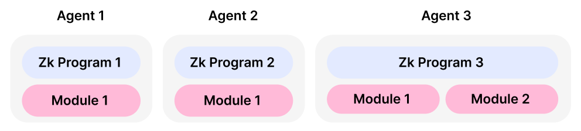

# Agents

Silvana’s Application Layer is represented by modules where the code is stored in monorepos. However, enterprises don’t interact with these modules directly. Silvana has no user interface, so it’s critical to have a pipeline to interact with Silvana’s modules and Core. Integrators, enterprises, and developers can use agents to perform functions contained in modules' repos.

Each agent implements a particular real-life use case - car lending, issuing and verifying documents, accounting, etc. A use case may require more than one module to be implemented. An agent assembles all the necessary components of different Silvana architectural layers: Prover and Verifier from Silvana Core, ZkProgram from the Module, ABI, etc.

To use a module’s function, an agent has to add the repo of the module as a dependency. Now, it can use the module’s code and ABI to build and execute transactions. To generate proofs, Agents have to get access to the **Prover Program** describing the proof generation rules, the Prover executing the **Prover Function (Circuit)**, and the **Verifier** executing the **Verifier Function (Circuit)**. All deployment options - **Private Executino Environment (PXE)**, **Cloud Execution Environment (CXE)**, and **Trusted Execution Environment (TEE)** - are available for Agents.

> **Note!**  
>
> * **Prover**: Silvana Core component responsible for the generation of ZK proofs based on provable record state changes.
> 
> * **Verifier**: Silvana Core component responsible for the verification the generated ZK proofs.
> 
> * **Prover Function (Circuit)** - the function allowing one party (the prover) to demonstrate to another party (the verifier) that they possess certain information without revealing the actual data itself.
> 
> * **Verifier Function (Circuit)** - the function allowing one party (the validator) validate the proof provided by another party (the prover) without gaining access to the actual information being proved.
> 
> * **Prover Program** - the business logic that rules how a proof has to be generated and verified.

The diagram below illustrates Silvana Agents.

> **Note!**  
>
> Agents are associated with the emergence of AI. An AI Agent is a software program designed to perform specific tasks or functions autonomously. It utilizes artificial intelligence techniques, such as machine learning, natural language processing, and computer vision, to make decisions, interact with their environment, and achieve their goals. AI agents can be found in various applications, including virtual assistants, autonomous vehicles, recommendation systems, and more.

> By leveraging AI agents, we can automate complex processes, enhance user experiences, and improve efficiency across diverse domains.

Using Agents helps automate Silvana functions and allows a wide array of useful options:

* **Account Abstraction**: Agents have a built-in user signature that enables transactions to run within the limits defined by the user without the necessity to be initiated directly by a user.

* **Scheduled Transactions**: Now transactions can run at a pre-planned time.
* **Pre-paid Transactions**: Users pay for transactions long before they run.
* **Event-triggered Transactions**: Transactions can be called by particular events that the Silvana agent catches as a witness. This allows for building apps with an event-based architecture. There needs to be some kind of middleman between modules and enterprises. In Silvana, those are agents that act both as interfaces and application builds.

Agents, like modules, are deployed by developers. After deployment, agents can be bought and sold on Silvana Marketplace.

## Agent Types

Agents come in the following types:

* **Data Layer Agents**: responsible for securely storing and managing data in a decentralized fashion.
* **Proving Agents**: process cryptographic verification, delivering proofs with high certainty and minimal human intervention.

Potentially, Silvana Agents can also extend to:

* **ZKML Agents**: this layer enables machine learning models to run in zero-knowledge and provable mode. It offers sophisticated data insights without exposing raw data and with proof of the model training set used.
* **AI Agents**: Can operate in secure enclaves or as standard AI modules, generating insights or additional encrypted data interpretations.
* **Human Agents**: Includes professionals or individuals who can provide manual checks, audits, or expert opinions.
* **Professional Agents**: Domain experts (finance, insurance, accounting, compliance) who add authoritative validation to marketplace proofs.