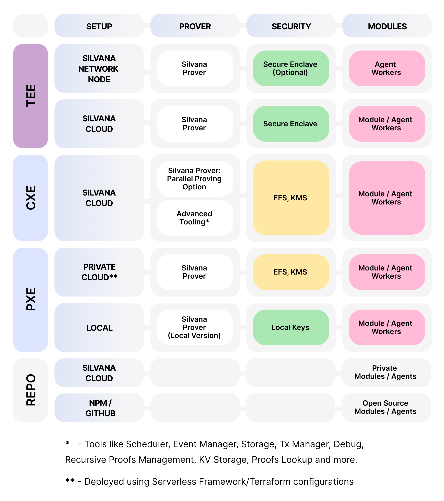

# Deployment Environments

## Deployment Options

Silvana offers flexible deployment arrangements to meet business needs. Enterprises can deploy all or some Silvana components of all architectural layers in Silvana Cloud or on their own infrastructure. Enterprises can use already existing modules and components or deploy their own ones.

There are three ways to deploy Silvana components: in the **Private Execution Environment (PXE)**, the **Cloud Execution Environment (CXE)**, and the **Trusted Execution Environment (TEE)**.

### Private Execution Environment (PXE)

With PXE. enterprises can deploy Silvana components either **locally** or in a **Private Cloud**. In the first case, the code of a module or Silvana component is forked from the REPO and saved locally for private use. Enterprises store their keys locally. Here, the following components can be deployed and stored: 

* modules and module workers, 
* a local version of the Silvana Prover.

The Private Cloud supports the **Serverless Framework** and deployment and automation tools like **Terraform**. This is what can be deployed in the Private Cloud: 

* EFS (Elastic File System), 
* modules and Module Workers, 
* Silvana Prover with the parallel proving option using recursive proofs.

### Cloud Execution Environment (CXE)

Silvana offers its official **Cloud** for those enterprises that don’t want to invest in their own infrastructure. This resembles what Amazon does - an AWS for zk computations on blockchains.

The following components can be deployed in **Silvana Cloud**: 

* EFS (Elastic File System), 
* modules and Module Workers,
* **Silvana Prover** with the parallel proving option using recursive proofs.

Additionally, Silvana Cloud offers these components:

* Scheduler for scheduled transactions,
* Event Manager for event-triggered transactions, 
* Storage in the DA Layer including Encrypted Storage, 
* Transaction Manager for automated transactions, 
* a set of Debug Tools, 
* Recursive Proofs Manager, 
* KV (Key-Value) Storage,
* Proof Lookup.

### Trusted Execution Environment (TEE)

Enterprises can use Silvana Cloud in the TEE, which acts as a Secure Enclave. Enterprises keep their keys in this space. Silvana ensures security against malicious use of keys and sensitive data by unauthorized users and insiders. Silvana Network Nodes provide decentralized proofs. Silvana Cloud is also available.

In both arrangements, the following components can be deployed: 

* Modules with Module Workers,
* Silvana Prover.

> **FYI**  
>
> **Secure Enclave** - the idea of a secure space for customers comes from Apple, where the Secure Enclave is a dedicated secure subsystem integrated into Apple devices designed to provide an extra layer of security by isolating sensitive user data from the main processor. The Secure Enclave uses a combination of hardware and software features, including a boot ROM, AES engine, and protected memory, to ensure the confidentiality and integrity of the data.

An enterprise can choose a hybrid deployment option. Thus, it’s possible to deploy modules privately while using Silvana Prover in the Silvana Cloud.

The diagram below illustrates the deployment options Silvana provides.

## Deployment Cases

Below are some real-life cases exemplifying how Silvana can be deployed in different situations.

### Case 1 - Car Rental Company

A car rental company needs to generate proofs for car rental operations. They want to keep secret the names of their customers. With these premises, they decide to fork Silvana Module “Car Rental“ in their Private Cloud and use Silvana Prover in Silvana Cloud.

### Case 2 - Military Equipment Manufacturer

A weapon company decides to use Silvana to manage their sales. They need to keep secred the names of their counterparts and the sold products. They fork Silvana modules to their local environment and use Silvana Network Nodes to generate proofs in the Trusted Execution Environment.

### Case 3 - Furniture Manufacturer

A furniture manufacturing company is an OJSC, and they decided to use Silvana for procurement. Since they want to keep everything public and open for accounting reasons, they use the most open deployment arrangements available. So, they use Silvana Modules, Silvana Prover, and all other available components in Silvana Cloud CEE: Scheduler, Event Manager, DA Layer, Transaction Manager, Debug Tools, Recursive Proofs Manager, and KV Storage.