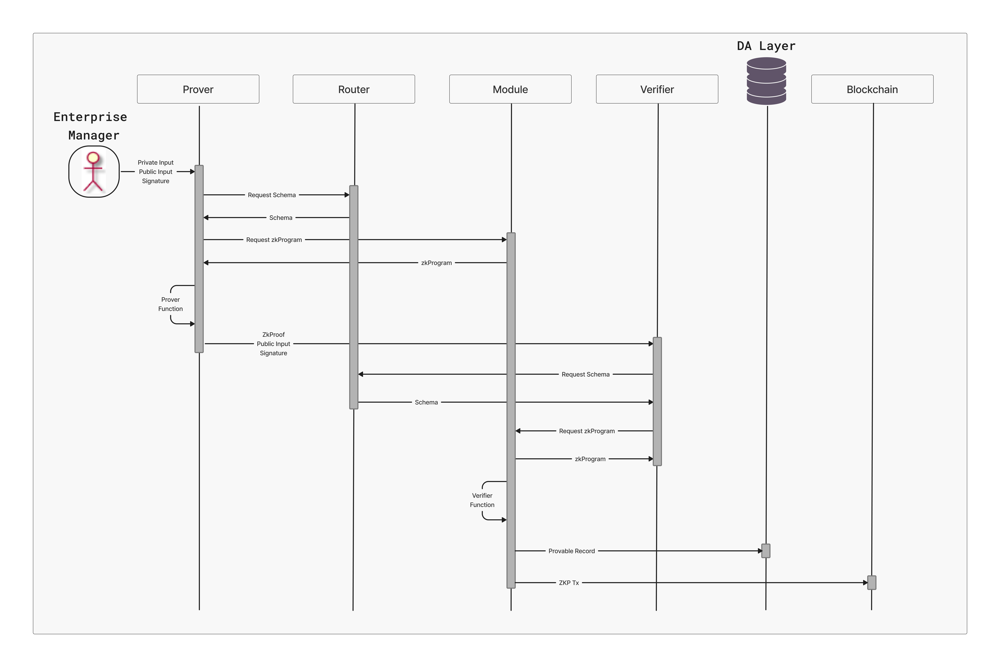

# Provable Records

## Provable Records: The Foundation of Trust in Silvana

Silvana presents a novel solution -  **Provable Records**. Unlike entities in account-based architectures, Provable Records function as autonomous digital objects, each possessing a structured set of fields, predefined behaviors, and cryptographic verifiability.

> **Warning:**  
> **Provable Records** are digitally verifiable representations of crypto and real-world assets.

By leveraging **Zero-Knowledge Proofs (ZKPs)**, provable records ensure trustless, private, and secure transactions while maintaining complete verifiability. They enable businesses to prove ownership, authenticity, and compliance without exposing sensitive data. Through Provable Records, Silvana bridges the gap between traditional asset management and blockchain technology, ensuring enterprises can integrate decentralized solutions seamlessly without compromising regulatory requirements or operational efficiency.

Each Provable Record comprises two essential elements:

1. **Schema**: Defines the structure of the record, specifying its fields and data types. This schema is stored in the Router, a centralized registry that maintains all schemas within the system.

2. **ZkProgram**: This program determines the operational logic of the object and outlines how it interacts with the system. Its behavior is described in a dedicated Module associated with the Provable Record.

## Provable Record Flow

To ensure the integrity and authenticity of Provable Records, Silvana employs the following components:

**Prover**: This component generates a zero-knowledge proof (ZKP) that validates the state and behavior of a Provable Record. The Prover retrieves the schema from the Router and the behavior from the corresponding Module. Using this information, a ZKP is constructed that attests to the record's compliance with predefined rules without revealing sensitive data.

**Verifier**: This component independently verifies the ZKP generated by the Prover. Without accessing the underlying data, the Verifier ensures that the Provable Record adheres to the established schema and behavior, maintaining trust and privacy within the system.

Provable records are objects that follow the general **CRUD** operations:

- **Create** Provable Record;
- **Read** Provable Record;
- **Mutate (Update)** Provable Record;
- **Delete** Provable Record.

All CRUD operations are available to the manager who created a provable record. Others can only read them from the DA Layer.

To create a provable record, first, a schema must be created in the Router, and the zkProgram must be deployed in the module.

## Create Provable Record

A provable record is created by this flow:

1. An enterprise manager initiates a transaction by providing the private input, the public input, and the signature.
2. The **Prover** queries the **Router** to obtain the provable record's schema and then retrieves the **zkProgram** from the associated **Module**, ensuring compliance with predefined logic.
3. Using the schema and the Private Input, the Prover generates a **Zero-Knowledge Proof (ZKP)** for the private input without exposure.
4. The **Verifier** queries the Router to obtain the provable record's schema and then retrieves the zkProgram from the associated Module, ensuring compliance with predefined logic.
5. The Verifier checks the ZKP to confirm that the record adheres to its schema and the zkProgram, ensuring its authenticity without accessing the Private Input.
6. The Provable Record is recorded in the **DA Layer**.
7. The transaction is recorded in the **Settlement Layer** (L1 or L2 blockchain).

## Mutate (Update) Provable Record

Anytime a transaction runs with a provable record, both the enterprise manager and the counterparty manager participate in and sign it. Mutation with a provable record runs in this flow:

1. An enterprise manager initiates a transaction by providing the private input, the public input, and the signature.
2. The Prover queries the Router to obtain the provable record's schema and then retrieves the zkProgram from the associated Module, ensuring compliance with predefined logic.
3. Using the schema and the Private Input, the Prover generates a Zero-Knowledge Proof (ZKP) for the private input without exposure.
4. The Verifier queries the Router to obtain the provable record's schema and then retrieves the zkProgram from the associated Module, ensuring compliance with predefined logic.
5. The Verifier checks the ZKP to confirm that the record adheres to its schema and the zkProgram, ensuring its authenticity without accessing the Private Input.
6. A manager on the counterpart's end checks if the proof is valid. If so, the manager signs the transaction. Otherwise, the transaction is aborted.
7. The Provable Record is recorded in the DA Layer.
8. The transaction is recorded in the Settlement Layer (L1 or L2 blockchain).

## Read Provable Record

Anytime a guest can read any provable record recorded on DA when needed. Then, the flow looks as follows:

1. A guest initiates a read transaction querying the DA layer.
2. The DA Layer provides info about the queried provable record if it's available.
3. The transaction is recorded in the Settlement Layer (L1 or L2 blockchain).

# Delete Provable Record

Anytime the manager that created a provable record can delete it from the DA layer. That's the flow:

1. An enterprise manager initiates the delete transaction.
2. If the provable record is available on the DA layer, it gets deleted, and the space it occupied is now vacant.
3. The transaction is recorded in the Settlement Layer (L1 or L2 blockchain).

## How Provable Records Work: Real-Life Use Case

In this case study, we'll explore how a playing card manufacturer can utilize Provable Records within Silvana's system to manage their production process securely. This approach ensures the integrity and authenticity of records while safeguarding sensitive information.

**Step 1: Asset Registration**

The manufacturer receives a shipment of card stock paper and registers it as a Provable Record, representing the raw material in the system.

**Provable Record: Raw Material (Card Stock Paper)**

| **Parameter** | **Data Type** | **Value** |
|---------------|---------------|-----------|
| assetId | string | 1247A8B97C23 |
| assetName | string | Card Stock |
| assetType | string | Raw Material |
| quantity | int | 10,000 sheets |
| supplierInfo | string | zk-proof |

> **Success:**  
> **_Note: the `supplierInfo` field is protected using a zero-knowledge proof (ZKP) to maintain confidentiality while enabling supplier verification._**

**Step 2: Production Process**

As the production begins, the card stock is transformed into finished playing card decks. This process involves updating the existing Provable Record to reflect the change from raw material to finished product.

**Updated Provable Record: Finished Product (Playing Card Decks)**

| **Parameter** | **Data Type** | **Value** |
|---------------|---------------|-----------|
| assetId | string | 1247A8B97C23 |
| assetName | string | Playing Cards |
| assetType | string | Finished Goods |
| quantity | int | 1,000 decks |
| productionDate | date | 2025-02-21 |

> **Success:**  
> **_Note: The `assetId` remains the same to maintain traceability, while other fields are updated to reflect the transformation._**

**Step 3: Sales Transaction**

Upon receiving an order, the manufacturer sells some finished playing card decks. This transaction is recorded by updating the Provable Record accordingly.

**Transaction Record: Sale of Playing Card Decks**

| **Parameter** | **Data Type** | **Value** |
|---------------|---------------|-----------|
| assetId | string | 1247A8B97C23 |
| assetName | string | Playing Cards |
| assetType | string | Sold Goods |
| quantity | int | 500 decks |
| saleDate | date | 2025-02-22 |
| buyerInfo | string | zk-proof |

> **Success:**  
> **_Note: The `buyerInfo` field is protected using a ZKP to ensure privacy._**

**ZK Program**

A ZK program is employed to maintain the confidentiality of sensitive information (such as supplier and buyer details). This program allows the manufacturer to prove the transaction's validity without revealing the data.

**ZK Program Overview**:

1. **Input**: Confidential details (e.g., `supplierInfo`, `buyerInfo`).
2. **Process**: Generate a cryptographic proof that verifies the legitimacy of the transaction.
3. **Output**: A proof that third parties can validate without accessing the confidential inputs.

As can be seen, Silvana sets a new standard in digital asset management by integrating provable records, structured data, and zero-knowledge proofs. 

Ensuring data integrity without compromising confidentiality enhances trust in blockchain-based systems and paves the way for broader enterprise adoption. The combination of security, transparency, and usability demonstrates a significant advancement in the development of Web3 technologies.