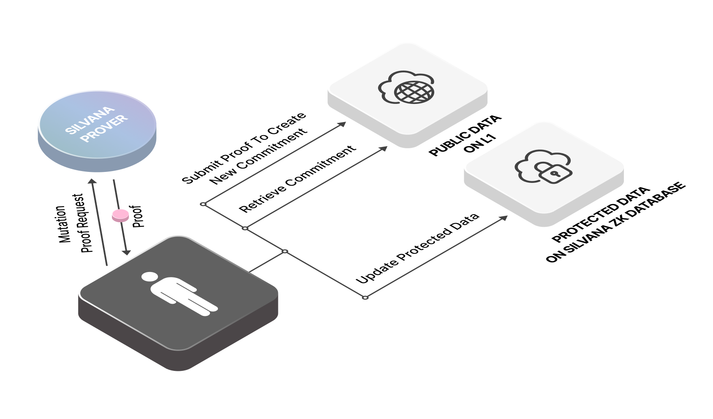
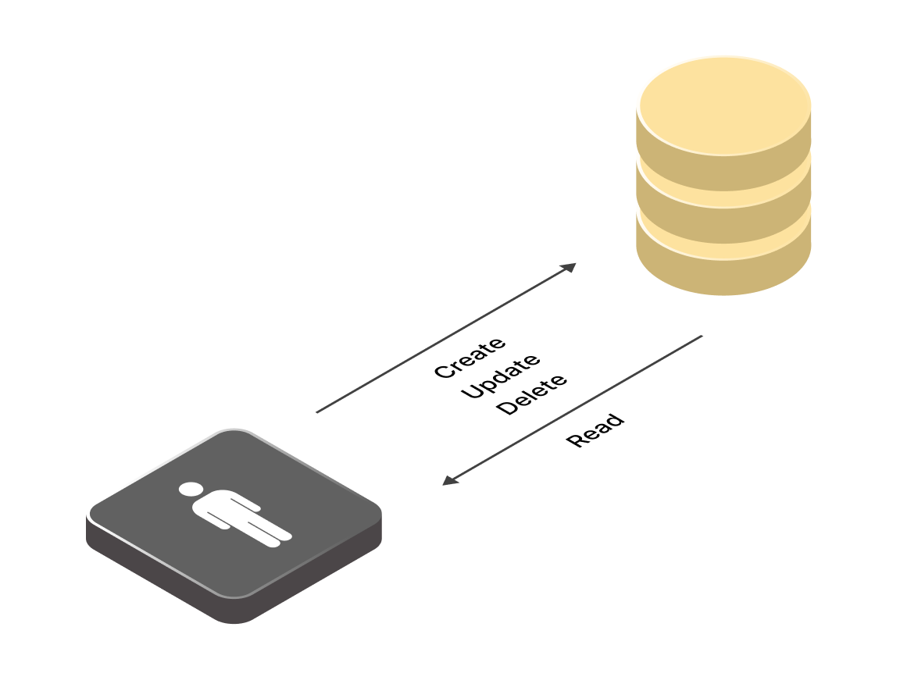
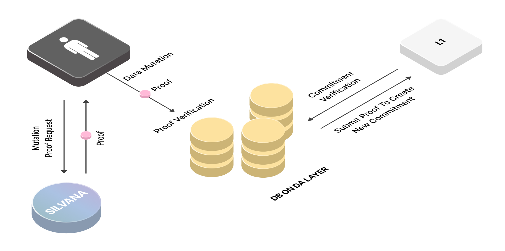

# Provable Records

## Provable Records: The Foundation of Trust in Silvana

Silvana presents a novel solution -  **Provable Records**. Unlike entities in account-based architectures, Provable Records function as autonomous digital objects, each possessing a structured set of fields, predefined behaviors, and cryptographic verifiability.

> **Note!**  
>
> **Provable Records** are digitally verifiable representations of crypto and real-world assets.

By leveraging **Zero-Knowledge Proofs (ZKPs)**, provable records ensure trustless, private, and secure transactions while maintaining complete verifiability. They enable businesses to prove ownership, authenticity, and compliance without exposing sensitive data. Through Provable Records, Silvana bridges the gap between traditional asset management and blockchain technology, ensuring enterprises can integrate decentralized solutions seamlessly without compromising regulatory requirements or operational efficiency.

> **Note!**  
>
> **Provable Records** A **ZKP** is a cryptographic protocol that allows one party (a **prover**) to demonstrate to another party (a **verifier**) that a specific statement is true **without revealing any underlying information**. The Verifier is convinced of the claim's truthfulness but gains no additional knowledge beyond its validity.

Each Provable Record comprises two essential elements:

1. **Schema**: Defines the structure of the record, specifying its fields and data types. This schema is stored in the Router, a centralized registry that maintains all schemas within the system.

2. **ZkProgram**: This program determines the operational logic of the object and outlines how it interacts with the system. Its behavior is described in a dedicated Module associated with the Provable Record.

## Provable Record Operations

To ensure the integrity and authenticity of Provable Records, Silvana employs the following components:

**Prover**: This component generates a zero-knowledge proof (ZKP) that validates the state and behavior of a Provable Record. The Prover retrieves the schema from the Router and the behavior from the corresponding Module. Using this information, a ZKP is constructed that attests to the record's compliance with predefined rules without revealing sensitive data.

> **Note!**  
>
> In the ***Prover Circuit**, a proof is generated to show that the mutation from **State n** to **State n+1** of a provable record was performed according to the zkProgram.

**Verifier**: This component independently verifies the ZKP generated by the Prover. Without accessing the underlying data, the Verifier ensures that the Provable Record adheres to the established schema and behavior, maintaining trust and privacy within the system.

> **Note!**  
>
> In the **Verifier Circuit**, a proof is generated to show that the latest state of a provable record is correct.

Provable records are objects that follow the general **CRUD** operations:

- **Create**;
- **Read**;
- **Mutate (Update)**;
- **Delete**.

All CRUD operations are available to the manager who created a provable record. Others can only read them from the DA Layer.

Provable record flow looks like this:

1. To create a provable record, first, a schema must be created in the Router, and the zkProgram must be deployed in the corresponding module.

2. User queries Silvana Prover to generate a zero-knowledge proof. Silvana Prover uses Pickles to create a recursive proof.

> **Note!**
> 
> * **Pickles** - an advanced cryptographic technique used for recursive zero-knowledge proofs.
> 
> * **Recursive Proof** - a special type of zero-knowledge proof that can verify other zero-knowledge proofs — including itself.

3. Then the proof is submitted to the DA layer.

4. At any time, the provable record can be retrieved for reading.

5. As another transaction runs changing the state of the provable record, its is mutated (updated).

The diagram below illustrates the provable record flow:

What’s special about the DA arrangements with Silvana is provable DB transactions meaning everytime a user calls the DA layer to read, write, delete, or update a provable record, Silvana generates proof for that, which means **provable read** and **provable mutation** of data. See how Silvana's solution compares to other DA layer arrangements.

### Traditional DB

With a traditional DB interaction pattern, a user runs a DB transaction without any proof being generated.

### Silvana Provable Data Mutation

With Silvana, each time data about a provable record is mutated, proof is generated. Then, the data mutation flow looks as follows:

1. A user makes a data mutation proof request in Silvana.

2. Silvana Prover generates proof.

3. The user verifies the proof.

4. The database on the DA Layer submits the proof to L1 to create a new commitment.

5. The commitment is verified.

6. The data about the provable record is mutated.

### Silvana Provable Record Reading

Whenever a user reads data in the DA Layer, Silvana generates proof. Now, the flow for proved data read looks like this:

1. A user makes a data read proof request in Silvana.

2. Silvana prover generates proof.

3. The user verifies the proof.

3. The database on the DA Layer submits the proof to L1 to create a new commitment.

4. The commitment is verified.

5. The user can read the data.

## How Provable Records Work: Real-Life Use Case

In this case study, we'll explore how a playing card manufacturer can utilize Provable Records within Silvana's system to manage their production process securely. This approach ensures the integrity and authenticity of records while safeguarding sensitive information.

**Step 1: Asset Registration**

The manufacturer receives a shipment of card stock paper and registers it as a Provable Record, representing the raw material in the system.

**Provable Record: Raw Material (Card Stock Paper)**

| **Parameter** | **Data Type** | **Value** |
|---------------|---------------|-----------|
| assetId | string | 1247A8B97C23 |
| assetName | string | Card Stock |
| assetType | string | Raw Material |
| quantity | int | 10,000 sheets |
| supplierInfo | string | zk-proof |

> **Success!**
> 
> the **_`supplierInfo`_** field is protected using a zero-knowledge proof (ZKP) to maintain confidentiality while enabling supplier verification.

**Step 2: Production Process**

As the production begins, the card stock is transformed into finished playing card decks. This process involves updating the existing Provable Record to reflect the change from raw material to finished product.

**Updated Provable Record: Finished Product (Playing Card Decks)**

| **Parameter** | **Data Type** | **Value** |
|---------------|---------------|-----------|
| assetId | string | 1247A8B97C23 |
| assetName | string | Playing Cards |
| assetType | string | Finished Goods |
| quantity | int | 1,000 decks |
| productionDate | date | 2025-02-21 |

> **Success!**
 
> The **_`assetId`_** remains the same to maintain traceability, while other fields are updated to reflect the transformation.

**Step 3: Sales Transaction**

Upon receiving an order, the manufacturer sells some finished playing card decks. This transaction is recorded by updating the Provable Record accordingly.

**Transaction Record: Sale of Playing Card Decks**

| **Parameter** | **Data Type** | **Value** |
|---------------|---------------|-----------|
| assetId | string | 1247A8B97C23 |
| assetName | string | Playing Cards |
| assetType | string | Sold Goods |
| quantity | int | 500 decks |
| saleDate | date | 2025-02-22 |
| buyerInfo | string | zk-proof |

> **Success!**
> 
> The **_`buyerInfo`_** field is protected using a ZKP to ensure privacy.

**ZK Program**

A ZK program is employed to maintain the confidentiality of sensitive information (such as supplier and buyer details). This program allows the manufacturer to prove the transaction's validity without revealing the data.

**ZK Program Overview**:

1. **Input**: Confidential details (e.g., **_`supplierInfo`_**, **_`buyerInfo`_**).
2. **Process**: Generate a cryptographic proof that verifies the legitimacy of the transaction.
3. **Output**: A proof that third parties can validate without accessing the confidential inputs.

As can be seen, Silvana sets a new standard in digital asset management by integrating provable records, structured data, and zero-knowledge proofs. 

Ensuring data integrity without compromising confidentiality enhances trust in blockchain-based systems and paves the way for broader enterprise adoption. The combination of security, transparency, and usability demonstrates a significant advancement in the development of Web3 technologies.

+1
