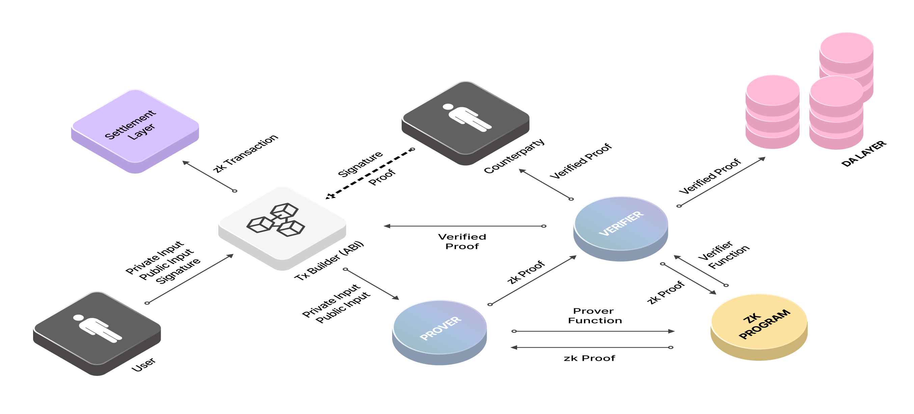
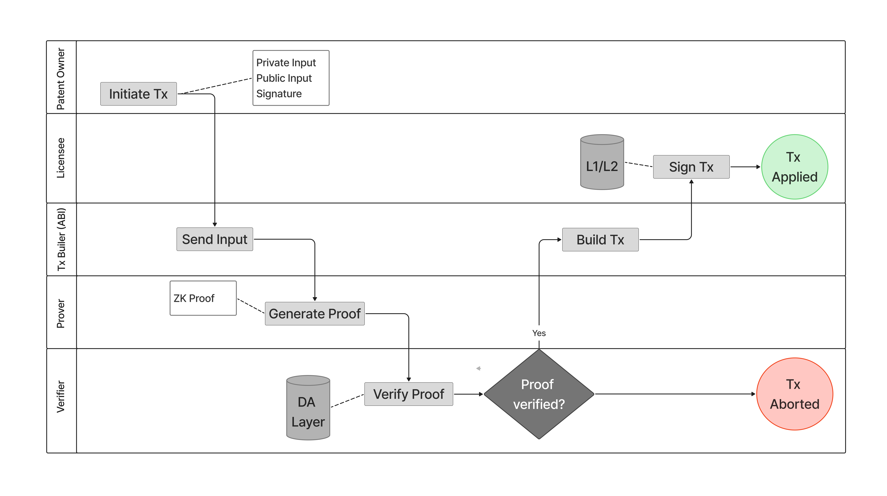

# Zero-Knowledge Proofs

# Overview

Balancing security and privacy has become a crucial challenge in the current digital landscape. Enterprises and individuals alike require trustless verification methods that do not compromise sensitive data. Traditional security models rely on extensive data exposure, where verifying a transaction, compliance, or ownership often reveals more information than necessary. The emergence of **Zero-Knowledge Proofs (ZKPs)** represents a paradigm shift, offering an approach where verification does not necessitate disclosure.
A ZKP is a cryptographic protocol that allows one party (a prover) to demonstrate to another party (a verifier) that a specific statement is true without revealing any underlying information. The Verifier is convinced of the claim's truthfulness but gains no additional knowledge beyond its validity.
> **Note:**  
>  
> A **ZKP** is a cryptographic protocol that allows one party (**prover**) to demonstrate to another party (**verifier**) that a specific statement is true **without revealing any underlying information**. The Verifier is convinced of the claim's truthfulness but gains no additional knowledge beyond its validity. 

Two types of data exist in a ZKP transaction: the **Private Input** and the **Public Input**. A prover and a verifier are smart contracts that contain the **zkProgram**. The Prover runs the **prover function (circuit)** to generate proof, and the Verifier runs the **verifier function (circuit)** to verify the generated proof.
- The **Prover** is called by the user, who must provide proof of the private input, 
- **Counterparty** calls the **Verifier** - a partner, a regulator, an individual, etc.

> **Note:**  
>  
> **Public Input** - the information the user keeps publicly available. 
>
> **Private Input** - the information to be concealed from the public eye. 
>  
> **Proof Job** - a proof generated to be shown in a transaction as a piece of cipher instead of the private Input.
>  
> **zkProgram** - the business logic that rules how a proof has to be generated and verified
>  
> **Prover Function (Circuit)** the function allowing one party (the prover) to demonstrate to another party (the verifier) that they possess certain information without revealing the actual data itself.
>  
> **Verifier Function (Circuit)** - the function allowing one party (the validator) validate the proof provided by another party (the prover) without gaining access to the actual information being proved.

For a proof to be considered zero-knowledge, it must satisfy three fundamental properties:

1. **Completeness** – If a statement is true, an honest verifier will be convinced by an honest prover.
2. **Soundness** – If a statement is false, a dishonest prover cannot convince the Verifier that it is true.
3. **Zero-Knowledge** – The proof reveals no information other than the statement's validity.

# How ZKPs work

Zero-knowledge proofs (ZKPs) enable secure data verification without revealing the data itself. The process involves structured steps that ensure transaction integrity while maintaining privacy.

ZKP Transaction flow now looks like this:

1. **User** initiates a transaction by providing the **Private Input**, the **Public Input**, and a **Signature**.
2. **Tx Builder** provides **Prover** with **public** and **private inputs**.
3. **Prover** executes the **Prover Function** and uses the **ZkProgram** to generate the **ZK Proof (proof job)**.
4. The **Verifier** executes the **Verifier Function** and uses the **ZkProgram** to verify and cryptographically sign the **ZK Proof**.
5. **Tx Builder** provides **Prover** with **public** and **private inputs**.
6. The verified **ZK Proof** is stored in the **Data Availability (DA) layer**.
7. The **Tx Builder** uses the **Public Input** and the **ZK Proof** to build a **ZK transaction**.
8. The **counterparty** signs the **ZK transaction**.
9. The zk Transaction is sent to the Settlement Layer (L1 or L2 blockchain).

The diagram below shows how ZKPs work.



# Real-World Case: Intangible Asset Verification

**Company: CertiChain – Blockchain-Based Digital Asset Certification**

CertiChain is a **blockchain-based certification platform** that allows companies and individuals to verify the authenticity of intangible assets such as patents, digital artwork, music rights, and academic certifications. The company provides a Zero-Knowledge Proof (ZKP)-based verification system that ensures authenticity without exposing confidential information.

<div class="case-study">
  <h3>Case: Patent Ownership Verification for Licensing Deal</h3>

  <p>A large technology firm, TechNova, wants to license a patent from an independent researcher, Dr. Lian Zhou. However, before proceeding with the contract, TechNova needs proof that Dr. Zhou is the legitimate patent owner. While proving ownership, Dr. Zhou does not want to expose sensitive details, such as unpublished patents or confidential legal agreements.</p>
</div>

The table below outlines what each actor and component wants to achieve with a ZKP transaction.

| Actor | Role | Goal |
|-------|------|------|
| Dr. Zhou | Patent Owner | Prove ownership of the patent without exposing private details. |
| TechNova | Licensee - Counterparty | Verify the proof before committing to a multi-million-dollar licensing agreement. |
| Silvana | Prover | Generate ZK proof for the patent details. |
| Silvana | Verifier | Verify ZK proof for the patent details. |

**Mapping to ZKP Transaction Flow**

**Step 1**: User (Patent Owner) Initiates Transaction.

**Dr. Zhou** (User) provides:

- **Private Input**: Full patent details
- **Public Input**: Patent hash
- **Signature**: Digital signature for authentication
```
{
  "private_input": {
    "owner_wallet": "B62qpnqhvK...",
    "patent_id": "US-987654321",
    "full_patent_document": "encrypted_base64_data"
  },
  "public_input": {
    "patent_hash": "0xABCD1234EF5678",
    "issuer": "CertiChain",
    "timestamp": "28.02.2025 UTC 09:40"
  },
  "signature": "0xSIG123456789"
}
```
> **Warning:**  
> If a signature mismatches, the process stops.

**Step 2**: Tx Builder (ABI) Sends Inputs to Prover
- **Tx Builder** prepares the inputs and sends them to **Prover**.

**Step 3**: Prover Executes Prover Function & Generates ZK Proof
Prover runs cryptographic operations using the **ZK Program** to prove:
- The patent exists.
- Dr. Zhou owns it.
A **ZK Proof** is generated.
```
{
  "zk_proof": "0xDEF456GH789IJ",
  "validity": "true",
  "proof_timestamp": "28.02.2025 UTC 09:41"
}
```
> **Success:**  
> ZK Proof was successfully created.

**Step 4**: Prover Sends ZK Proof to Verifier.
- The Verifier receives the **ZK Proof**.

**Step 5**: Verifier Executes Verifier Function & Signs Proof.
- The Verifier runs the ZK Program's Verifier Function.
- The proof is checked cryptographically against public data.
- If the proof is valid, the Verifier signs it.
- If not, the transaction gets aborted.

**Verifier Signed Proof Output**
```
{
  "verified_proof": "0xVERIFIED123ABC",
  "patent_hash": "0xABCD1234EF5678",
  "validity": "true",
  "signing_timestamp": "28.02.2025 UTC 09:42"
}
```
> **Warning:**  
> If the proof fails, the verification halts.

**Step 6**: Tx Builder Builds ZK Transaction.
- The **verified proof** is stored in the **DA Layer** for future reference.

**Stored Proof Record**
```
{
  "zk_proof_id": "zkp-09345",
  "verified_proof": "0xVERIFIED123ABC",
  "patent_hash": "0xABCD1234EF5678",
  "storage_timestamp": "28.02.2025 UTC 09:42"
}
```
> **Success:**  
> Proof securely recorded.

**Step 7**: **Tx Builder** Uses Public Input & ZK Proof to Build a **ZK Transaction**.
- The Tx Builder builds the ZK Transaction.
**ZK Transaction Build**
```
{
  "transaction_id": "txn-56789",
  "zk_proof_id": "zkp-09345",
  "public_input": "0xABCD1234EF5678",
  "proof": "0xVERIFIED123ABC"
}
```
**Step 8**: Counterparty (TechNova) Signs the ZK Transaction.
- TechNova (Counterparty) reviews and signs the transaction.
**TechNova's Signed Transaction**
```
{
  "transaction_id": "txn-56789",
  "counterparty_signature": "0xTECHSIG987654"
}
```
> **Success:**  
> The counterparty has signed and approved the transaction.

**Step 9**: ZK Transaction is Sent to the Settlement Layer (L1 or L2 blockchain).

**Step 9**: ZK Transaction Sent to Settlement Layer (Blockchain L1/L2)
- The final ZK Transaction is published to the blockchain.
- **Settlement** completed securely, with patent verification recorded permanently.
**Final Settlement Record on Blockchain**
```
{
  "transaction_id": "txn-56789",
  "zk_proof_id": "zkp-09345",
  "blockchain_record": "0xBLOCKHASH123456"
}
```
> **Success:**  
> The transaction is now immutable on-chain.

**Final Outcome: Secure, Private Patent Verification**

- Dr. Zhou's patent ownership is cryptographically verified.
- TechNova has proof of authenticity without exposing private details.
- The verification is permanently stored for future licensing deals.
- Re-verification is needed for future licensing or disputes.
The diagram below shows the flow of the use case.



**Key Takeaways from the ZKP Flow**

1. **Privacy**: Patent details never exposed.
2. **Security**: Only cryptographic proof is shared.
3. **Trustless Verification**: TechNova does not need to trust Dr. Zhou.
4. **Efficiency**: The entire process is automated and immutable.

# How Silvana Uses ZKPs

Silvana implements Zero-Knowledge Proofs (ZKPs) to ensure privacy and security in its transaction validation process. Below is a detailed breakdown of how proofs are generated, who is responsible for different stages, the architectural layers involved, and the components engaged in the process.
**Silvana ZKP Infrastructure**
| Stage | Who Performs It | Process Description | Architectural Layer | Components Involved |
|-------|-----------------|---------------------|---------------------|---------------------|
| Transaction Build | User / Smart Contract | A transaction request includes private (sensitive asset data) and public inputs (metadata, timestamps). A hash of sensitive data is generated. | Private + Cloud Application Layer | User Interface, Smart Contracts |
| Sequencing & Ordering | Sequencer (Silvana Network) | The transaction is added to a mempool, ordered for execution, and checked for double spending before moving to the proving stage. | Blockchain Execution Layer | Sequencer Node |
| Zero-Knowledge Proof (ZK Proof) Generation | zkProver (Enterprise-side) | The zkProver verifies that private inputs satisfy the defined rules without revealing sensitive data and then generates a cryptographic proof. | Private Execution Layer | zkProver Node |
| Proof Verification | Verifier (Silvana Network) | The Verifier checks the proof's validity using cryptographic verification. If the proof is valid, it is confirmed and recorded. If invalid, the transaction is rejected. | Trusted Execution Layer | Verifier Node |
| Proof Storage & Compliance | Silvana Core System | The proof and metadata are stored in the Silvana ledger, ensuring auditability without exposing sensitive data. | Data Availability Layer | Storage Nodes, Compliance System |

# Silvana's Innovations in the Zero-Knowledge Technology

Unlike many projects that partially implement ZKPs, Silvana provides:

1. **True ZK Integration:** a fully private and decentralized data verification system
2. **ZK Abstraction:** businesses can use ZKPs through simple APIs without needing blockchain expertise
3. **Enforced Computational Rules:** Ensures cryptographic security and prevents manipulation.
4. **Modular Architecture:** Allows businesses to integrate Silvana flexibly.
5. **Ultra-fast, Scalable Solution:** Most ZKP projects are computationally heavy and weigh much on CPU; Silvana uses the Coordination Layer on fast object-centric blockchains like Sui or Solana to marry the two worlds: secure and private ZKPs with fast and scalable transactions.
6. **Blockchain-Agnostic Interoperability:** Compatible with various L1s, L2s, and data availability layers.