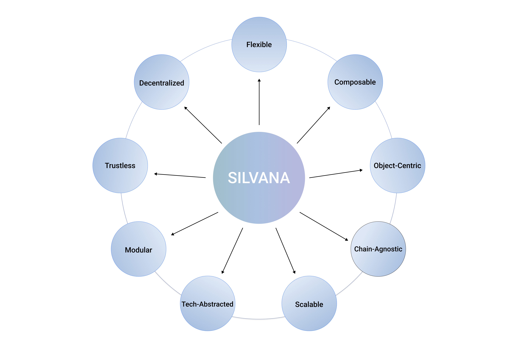

# What is Silvana Like?

# Overview

Silvana is a next-generation ultra-fast profer platform designed for **flexibility**, **security**, and **interoperability**. Overall, it can be described with the following words:

- **Object-Centric**: Treats data as programmable objects rather than accounts
- **Modular (application layer)**: Enterprises can deploy with standard or custom modules
- **Chain-Agnostic**: Works across different blockchain platforms
- **Composable**: Components can be combined in various ways
- **Flexible (deployment)**: Adaptable to different enterprise needs
- **Tech-Abstracted**: Hides complexity behind intuitive interfaces
- **Scalable**: Designed to handle growing transaction volumes
- **Decentralized**: Operates without central control points
- **Trustless**: Verification without requiring trust between parties

**Object-Centric**

Most blockchains use an **account-based model**, tracking balances linked to accounts. They store and mutate states of accounts. While common, this creates inefficiencies in privacy, scalability, and security. Silvana takes a different approach with an **object-centric model**, where data is structured around **self-contained objects** - **provable records** - rather than accounts. These provable records represent crypto and real-world assets and function as independent units of value, identity, or state, ensuring better control, privacy, and modularity.

<blockquote class="info">
  <strong>Information:</strong>  
  
  Silvana is not the first to employ the object-central design. Among other projects are Sui, Solana, and Aptos. Arranging data around objects allows a wide array of use cases, enables deployment of more complicated custom logic, and optimizes data storage introducing Data Availability (DA) layers.
</blockquote>

Each transaction is tied to an object rather than a loose set of inputs and outputs. Objects contain both **private** and **public states**, allowing verification without exposing sensitive data. This significantly enhances security and prevents redundant validations. Think of it like a sealed vault: you can prove its authenticity without revealing its contents, enabling trustless interactions and privacy-first applications.

# Modular

**Silvana’s Modular Application Layer** is designed to give enterprises the ability to build, deploy, and manage blockchain applications efficiently by structuring code into functional, purpose-driven modules. Instead of committing to a rigid, **monolithic system**, enterprises can deploy only the components they need and expand over time. Moreover, they can add custom modules to fit their business needs. Later, these modules can be sold at Silvana Marketplace as blueprints.

Each module functions as an independent unit, reducing development friction. Examples include payment processing for financial services, NFT management for gaming, and provable record tracking for supply chains and real estate. By leveraging modularity, enterprises can integrate pre-built modules or develop custom ones, significantly cutting costs and deployment times.

This modular design introduces a new **real-world asset (RWA)** management standard in crypto, enabling enterprises to tokenize and handle assets, transactions, and records in a provable yet private way. 

# Chain-Agnostic

Silvana is designed to be fully chain-agnostic, meaning it operates **independently of any specific blockchain, cryptographic function, or proving system**. It seamlessly integrates with any Layer 1 (L1), Layer 2 (L2), Data Availability (DA) layer, or Prover, ensuring enterprises and developers are never restricted to a single ecosystem. This flexibility allows for smooth interoperability, enabling users to select the best infrastructure for their needs without being locked into a specific blockchain.

By combining these capabilities, Silvana creates a flexible framework that enables seamless, trustless verification across multiple blockchain ecosystems.

# Composable

Silvana stands apart in its ability to integrate **Zero-Knowledge (ZK)** technologies across multiple blockchains, **even in environments where these technologies do not natively exist**. This composability enables businesses, developers, and institutions to implement advanced cryptographic solutions without the need to switch infrastructures or adopt new programming paradigms.

Unlike other systems that require specific compilers or programming languages, Silvana allows developers to work in **any programming language** while ensuring compatibility across different blockchain infrastructures.

By removing **compiler dependencies**, Silvana eliminates friction in adopting zero-knowledge proofs (ZKPs) for authentication, ownership, or compliance. Businesses can integrate advanced cryptographic solutions without switching infrastructures or modifying their existing stack.

# Flexible (deployment)

Silvana’s architecture is designed for seamless deployment across **multiple execution environments (TEE, PXE, CXE)**, ensuring adaptability for various enterprise needs. In contradistinction to rigid blockchain infrastructures, Silvana allows its components to function independently while remaining interoperable, enabling businesses to tailor their blockchain integration efficiently. This tiered structure ensures enterprises can optimize for performance, privacy, or security based on their specific requirements.

Silvana provides enterprises with full deployment control without the constraints of traditional blockchain systems. Whether running locally, in the cloud, or in a secure enclave, businesses can integrate Silvana **without disrupting existing workflows**. By combining execution flexibility with modular architecture, Silvana ensures seamless adoption and scalability across industries.

# Tech-Abstracted

Silvana is designed to **abstract the complexity** of the ZKP technology and blockchain infrastructure. Users and developers do not need in-depth knowledge of ZKPs, rollups, or data availability layers to build and deploy applications. Instead, Silvana provides a seamless space where these technical components function in the background, enabling intuitive and efficient integration.

This abstraction ensures that enterprises and developers can focus on business logic rather than low-level blockchain mechanics. Whether leveraging advanced proving systems, cross-chain interoperability, or secure execution environments, Silvana automates the complexities, making high-assurance blockchain applications accessible to a broader audience.

# Scalable

Most blockchains choke under the weight of growing state and computation, but Silvana avoids this issue by turning all state changes into **provable records**. These records are compact, self-contained, and can be verified independently — meaning data doesn’t need to constantly be replayed or revalidated across the entire chain.

More importantly, Silvana offloads the burden of proof generation to a decentralized prover network, distributing computational work across nodes operated by diverse participants. Each node competes to generate proofs faster and cheaper, creating a natural scaling mechanism that aligns economic incentives with performance. Combined with flexible deployment across PXE, CXE, or TEE environments, Silvana’s scaling strategy is **application-first**, ensuring enterprises can grow their use cases without worrying about hitting technical ceilings.

One more solution that ensures Silvana’s high scalability and transaction speed is the Coordination Layer that’s deployed on the Sui Network - one of the fastest blockchains out there.

# Decentralized

Silvana distributes proof generation, data management, and state verification across independent participants, removing any single point of control. Proof generation happens across a distributed Prover Network, where independent nodes compete to create valid proofs. This shifts control away from any single entity, making **proof creation an open process**.

Data is managed by **Data Availability Nodes** — either in Silvana’s public network or inside private deployments — ensuring records can be stored, updated, and verified across environments. Enterprises can either rely on the shared network or operate their own infrastructure without breaking compatibility.

This layered decentralization allows enterprises to stay compliant with internal policies while still benefiting from a global network of independent validators, ensuring Silvana itself can’t interfere with the provability of records.

# Trustless

Trustlessness in Silvana means every step of every process produces its own proof — from record creation to data updates and compliance checks. These proofs follow predefined computational rules (**zkPrograms**), which describe exactly what is allowed and how it must be verified.

Because all proofs are **self-verifiable**, anyone — from regulators to business partners — can check the outcome without asking Silvana or any trusted party for confirmation. This removes the need for **external audits or manual attestations**.

Even if Silvana’s infrastructure disappeared, every provable record and its full history would remain independently verifiable through its chain of proofs, ensuring businesses stay in full control of their data truth.