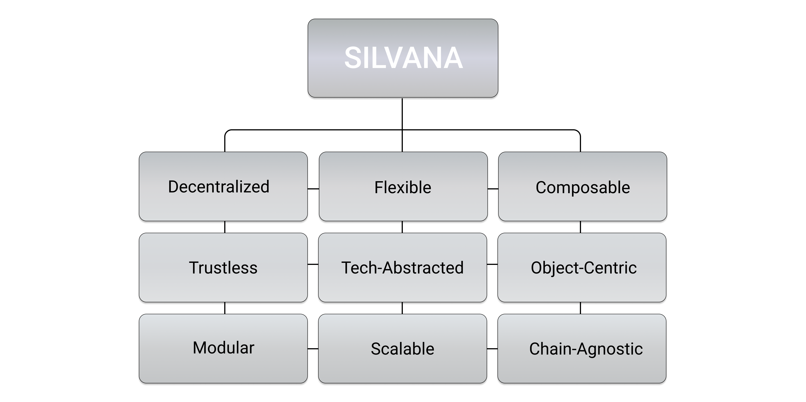

# What is Silvana Like?

## Overview

Silvana is a next-generation ultra-fast profer platform designed for **flexibility**, **security**, and **interoperability**. Overall, it can be described with the following words:

- **Object-Centric**: treats data as programmable objects rather than accounts
- **Modular (application layer)**: enterprises can deploy with standard or custom modules
- **Chain-Agnostic**: works across different blockchain platforms
- **Composable**: components can be combined in various ways
- **Flexible (deployment)**: adaptable to different enterprise needs
- **Tech-Abstracted**: hides complexity behind intuitive interfaces
- **Scalable**: designed to handle growing transaction volumes
- **Decentralized**: operates without central control points
- **Trustless**: verification without requiring trust between parties

## Object-Centric

Most blockchains use an **account-based model**, tracking balances linked to accounts. They store and mutate states of accounts. While common, this creates inefficiencies in privacy, scalability, and security. Silvana employs an **object-centric model**, which means that:

- Data is stored in self-contained objects - **provable records** - instead of accounts.
- Objects represent crypto or real-world assets and act as units of value, identity, or state.
- Sensitive data remains hidden, yet can still be proven valid through zero-knowledge methods.

> ### **Note:**  
> Silvana is not the first to employ the object-central design. Among other projects are Sui, Solana, and Aptos. Arranging data around objects allows a wide array of use cases, enables deployment of more complicated custom logic, and optimizes data storage introducing Data Availability (DA) layers.

## Modular

**Silvana's Modular Application Layer** is designed to give enterprises the ability to build, deploy, and manage blockchain applications efficiently by structuring code into functional, purpose-driven modules. Instead of committing to a rigid, **monolithic system**, enterprises can deploy only the components they need and expand over time.

- Each module functions as an independent unit, reducing development friction.
- Pre-built modules handle diverse needs like payments or NFTs.
- A new Real-World Asset (RWA) management standard that lets enterprises tokenize and manage assets, transactions, and records with provable privacy.

## Chain-Agnostic

Silvana is designed to be fully chain-agnostic, meaning it operates **independently of any specific blockchain, cryptographic function, or proving system**. 

- Works with various L1s, L2s, DA layers, and proving systems.
- Removes the risk of being tied to a single blockchain ecosystem.
- Enables smooth cross-chain verification.

## Composable

Unlike systems that require specific compilers, Silvana’s approach removes many adoption hurdles. **Zero-knowledge proofs (ZKPs)** can easily integrate advanced cryptographic proofs without major rewrites of existing code. As a result, organizations gain powerful cryptographic capabilities seamlessly.

- Zero-Knowledge tech can be added to multiple blockchains, **even in environments where these technologies do not natively exist**.
- No forced **compiler dependencies** or **any programming language reliance**.

## Flexible (deployment)

In contrast to rigid blockchain infrastructures, Silvana allows its components to function independently while remaining interoperable, enabling businesses to tailor their blockchain integration efficiently. 

- Silvana offers multiple execution environments: **Private Execution Environment (PXE)**, **Cloud Execution Environment (CEE)**, and **Trusted Execution Environment (TEE)**.
- Whether running locally, in the cloud, or in a secure enclave, businesses can integrate Silvana **without disrupting existing workflows**.

## Tech-Abstracted

Users and developers do not need in-depth expertise in ZKPs, rollups, or data availability layers to build and deploy applications. Instead, Silvana provides a seamless space where these technical components function in the background, enabling intuitive and efficient integration. All of this:

- Simplifies ZK and blockchain adoption by **abstracting complexity**.
- Minimizes the learning curve for enterprises and developers.
- Enables faster, more intuitive application development.

## Scalable

Most blockchains choke under the weight of growing state and computation, but Silvana avoids this issue by turning all state changes into **provable records**. These records are compact, self-contained, and can be verified independently, meaning data doesn’t need to constantly be replayed or revalidated across the entire chain.

- The scaling strategy is **application-first**, ensuring enterprises can grow their use cases without worrying about hitting technical ceilings.
- The **Coordination Layer** deployed on the Sui Network ensures high scalability and transaction speeds.

## Decentralized

Silvana distributes proof generation, data management, and state verification across independent participants, removing any single point of failure or control. Proof generation happens across a distributed **Prover Network**, where independent nodes compete to create valid proofs. Silvana Network:

- Shifts control away from any single entity, making **proof creation an open process**.
- Ensures that data is managed by **Data Availability Nodes** - either in Silvana’s public network or inside private deployments, ensuring records can be stored, updated, and verified across environments.
- Allows for **private** or **public setups** while remaining interoperable.

## Trustless

Trustlessness in Silvana means every step of every process produces its own proof: from record creation to data updates and compliance checks. These proofs follow predefined computational rules (**zkPrograms**), which describe exactly what is allowed and how it must be verified.

- Every process step has a corresponding **self-verifiable proof**.
- **No external audits** or **manual attestations** are required for validation.
- Records remain verifiable regardless of Silvana’s presence.