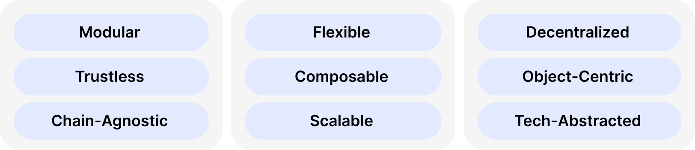

# What is Silvana Like?

Silvana is designed for **flexibility**, **privacy**, and **interoperability**. Overall, it can be described with the following words:

* **Object-Centric**: treats data and assets as programmable objects rather than accounts;
* **Modular**: businesses can deploy with standard or custom modules;
* **Chain-Agnostic**: works across different networks;
* **Composable**: components can be combined in various ways;
* **Flexible**: configurable deployment to meet business needs;
* **Tech-Abstracted**: hides complexity behind intuitive interfaces;
* **Scalable**: ultra-fast and designed to handle growing transaction volumes;
* **Decentralized**: operates without central control points;
* **Trustless**: verification without requiring trust between parties.

 0