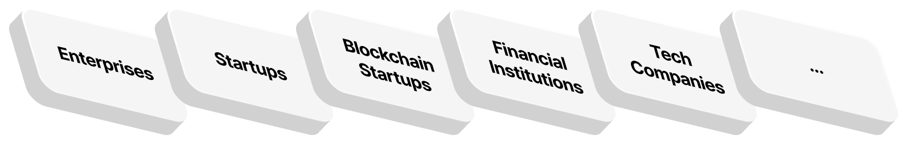
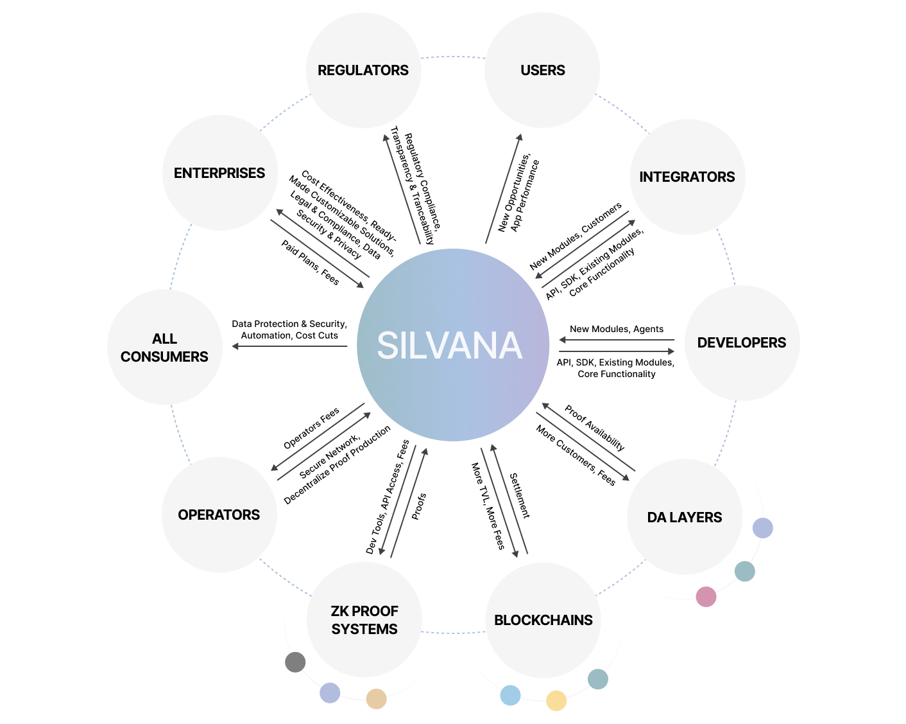

# Who Uses and Benefits from Silvana?

# Beneficiaries

Silvana customers and primary beneficiaries are standalone **enterprises** and **startups** (including **blockchain startups**), industry **integrators**, and **developers**. Our solution will also benefit **tech companies**, **blockchain ecosystems (settlement layer blockchains, data availability layers, ZK proof systems, individual users)**, **government agencies**, and **regulators**.

The table below features major beneficiaries and the value Silvana provides them.

| Beneficiaries | How they use Silvana | Value |
|---------------|----------------------|-------|
| Enterprises | Digital and off-chain enterprises use Silvana to manage their assets, either directly or through integrators | • improved cost-effectiveness by automating and tokenizing their assets • ready-made, customizable solutions to meet their business needs • ensured legal compliance • guaranteed data security and privacy • cross-chains transactions |
| Integrators and Developers | Integrators are key players that aggregate enterprises and cater to their needs. With their expertise, they act as intermediaries between enterprises and Silvana. | • a ready-made, customizable module solution • fast and easy onboarding, thanks to well-packaged modules, API, and SDK for building applications with ZK proofs • the ability to deploy solutions on any blockchain, in any environment, and with any technology due to complexity abstraction and a blockchain-agnostic approach • an expanded customer base among enterprises, leading to a more extensive portfolio |
| Blockchain Ecosystem | Silvana significantly benefits four key actors in blockchain systems: Settlement Layer (L1, L2) blockchains, Data Availability (DA) layers, ZK Proof Systems capable of handling private data (frameworks, compilers, zk-specific languages), and blockchain users. | **Settlement Layer Blockchains:** • increased transaction activity • higher Total Value Locked (TVL) • more transaction fees paid  **DA Layer:** • enhanced data recording • increased storage fees paid  **ZK Proof Systems:** • integration capabilities • development tools • API access  **Blockchain Users:** • expanded functionality • improved asset ownership and management • ensured data privacy and security |
| Regulators | Regulators and government agencies ensure compliance with asset management laws. They need Silvana to monitor compliance with enterprises | • guaranteed legal compliance • enhanced transaction transparency and traceability |

The diagram below provides a clear and comprehensive overview of Silvana's advantages for different stakeholders in the blockchain ecosystem.

# Users and Roles

Basically, all Silvana users can be classified into four roles: **enterprise manager**, **developer**, **guest**, and **operator**.

| Role | Description | Silvana Components | Functions |
|------|-------------|-------------------|-----------|
| Manager | Representatives of enterprises (start-ups) or industry integrators. They primarily deal with provable records to complete their business goals as provided by the modules they use. | Prover Verifier Marketplace DA Layer Router | • create, read, mutate (update), delete, and sell provable record schemas • create, read, mutate (update), delete provable records • buy items on Marketplace (provable records, provable record schemas, modules, blueprints, etc.) |
| Developer | Representatives of enterprises (start-ups) or industry integrators, or independent programmers who build Silvana's Application Layer | Marketplace DA Layer Application Layer ABI API Indexer Tx Monitor | • develop, deploy, sell, and delete modules, agents and blueprints |
| Guest | Third parties that can only view provable records, schemas, modules, or marketplace items. They can be regular blockchain users, regulators, stakeholders, entrepreneurs, authorities, analysts, etc. | Silvana Router DA Layer Marketplace | • read provable records • read provable record schemas • read marketplace items (modules, schemas, agents, blueprints, etc.) |
| Operator | Those who run nodes in the Silvana Network, thus providing the infrastructure for decentralized proving. | Silvana Network | • run nodes |

Silvana roles are interchangeable, meaning that one user can, in different situations, perform different roles. Let's see some examples:

**Case 1**

**User A** is a developer who builds modules in the Application Layer for an industry integrator. When User A develops and deploys a new module in a repo or builds an agent, he or she performs the role of a **Developer**. Now, as User A looks through the provable records created by other counterparts, he or she can only read them being a **Guest**. If User A runs a prover in the Silvana Network, he or she becomes an **Operator**.

**Case 2**

**User B** is an enterprise manager. When it comes to the provable records and provable record schemes that he or she created, User B is a **Manager**. As for the provable records created by someone else, User B is a **Guest**.