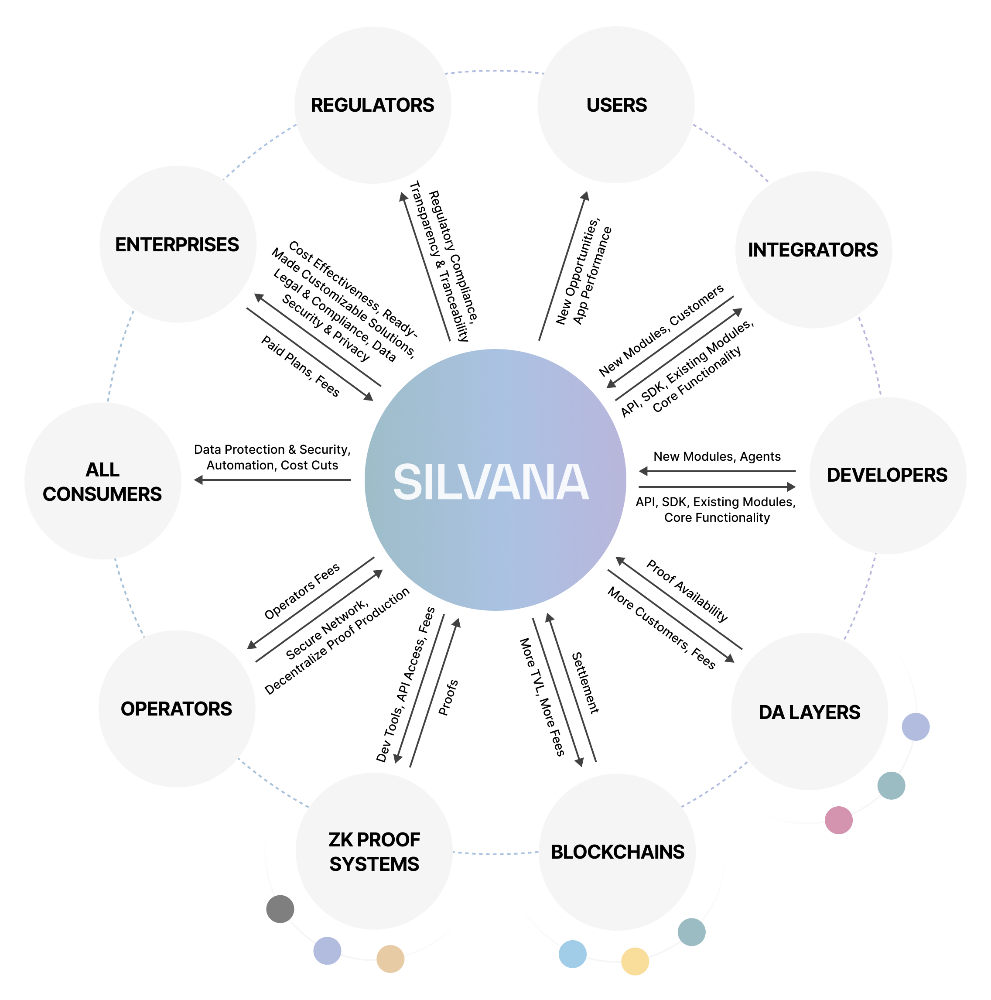

# Who Uses and Benefits from Silvana?

## Beneficiaries

Silvana customers and primary beneficiaries are standalone **enterprises** and **startups** (including **blockchain startups**), industry **integrators**, and **developers**. Our solution will also benefit **tech companies**, **blockchain ecosystems (settlement layer blockchains, data availability layers, ZK proof systems, individual users)**, **government agencies**, and **regulators**.

The table below features major beneficiaries and the value Silvana provides them.

| Beneficiaries | How they use Silvana | Value |
|---------------|----------------------|-------|
| Enterprises | Digital and off-chain enterprises use Silvana to manage their assets, either directly or through integrators | • improved cost-effectiveness by automating and tokenizing their assets • ready-made, customizable solutions to meet their business needs • ensured legal compliance • guaranteed data security and privacy • cross-chains transactions |
| Integrators and Developers | Integrators are key players that aggregate enterprises and cater to their needs. With their expertise, they act as intermediaries between enterprises and Silvana. | • a ready-made, customizable module solution • fast and easy onboarding, thanks to well-packaged modules, API, and SDK for building applications with ZK proofs • the ability to deploy solutions on any blockchain, in any environment, and with any technology due to complexity abstraction and a blockchain-agnostic approach • an expanded customer base among enterprises, leading to a more extensive portfolio |
| Blockchain Ecosystem | Silvana significantly benefits four key actors in blockchain systems: Settlement Layer (L1, L2) blockchains, Data Availability (DA) layers, ZK Proof Systems capable of handling private data (frameworks, compilers, zk-specific languages), and blockchain users. | **Settlement Layer Blockchains:** • increased transaction activity • higher Total Value Locked (TVL) • more transaction fees paid  **DA Layer:** • enhanced data recording • increased storage fees paid  **ZK Proof Systems:** • integration capabilities • development tools • API access  **Blockchain Users:** • expanded functionality • improved asset ownership and management • ensured data privacy and security |
| Regulators | Regulators and government agencies ensure compliance with asset management laws. They need Silvana to monitor compliance with enterprises | • guaranteed legal compliance • enhanced transaction transparency and traceability |

The diagram below provides a clear and comprehensive overview of Silvana's advantages for different stakeholders in the blockchain ecosystem.

