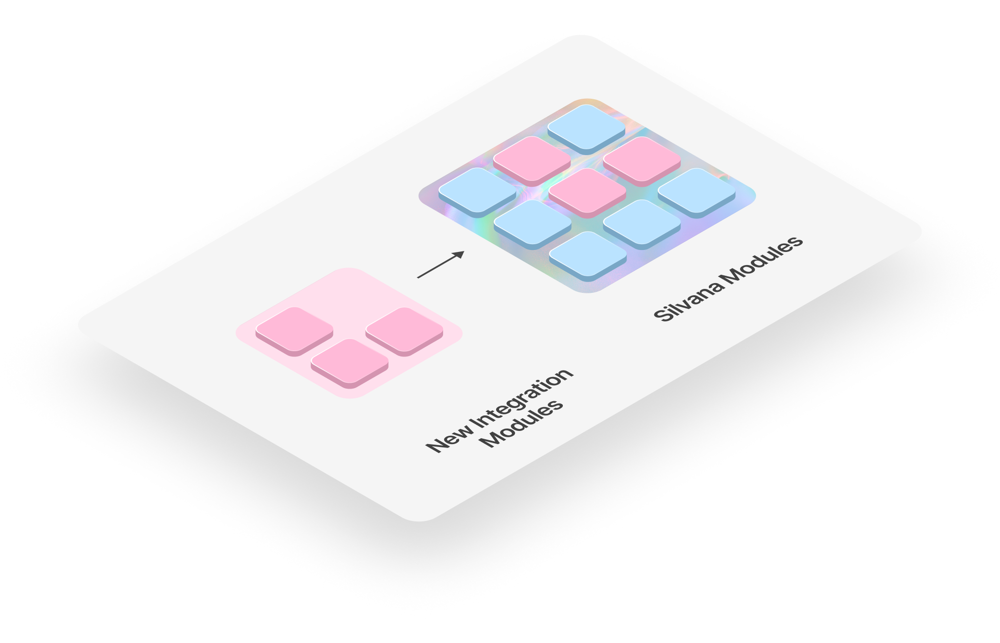

# Application Layer

## Overview

The **Application Layer** in Silvana is where real-world business logic comes alive. It is the core interface for end users — including **enterprises**, **startups**, **industry integrators**, and **developers** — to build, deploy, and manage blockchain applications tailored to specific use cases. This layer abstracts the cryptographic and infrastructural complexities, enabling teams to focus purely on their application logic. 

## Modules

The Application Layer is composed of modular, plug-and-play components called [**modules**](/category/modules), which encapsulate functionality for a specific domain. These modules are designed for **composability**, **customization**, and **reuse** across a wide range of industries. They allow businesses to tokenize assets, verify documents, manage transactions, and more — all while leveraging [**Zero-Knowledge Proofs (ZKPs)**](/Documentation/key-concepts/zk-proofs).

These modules are accessible via **mono repos** and integrate seamlessly into different [**environments**](/Documentation/Deployment/deployment-environments) (**PXE**, **CXE**, **TEE**), making the Application Layer both powerful and flexible.

## Silvana Baseline Modules

The following baseline modules are developed and maintained by Silvana to cover basic operations and use cases:

* Transactions Module

* NFT Module

* Fungible Tokens Module

* DEX Module

* Token Launchpad Module

* and more...

With time, more such modules will be added. Enterprises, integrators, and developers can additionally develop more modules to meet their business requirements, too. This will enrich our Application layers and cover more and more use cases. 

### Join the club

Silvana allows developers and integrators to build their own modules by:

1. Forking existing mono repos
2. Creating custom **Prover Programs** with business rules
3. Integrating with Silvana’s **ABI**, **Router**, and **Prover/Verifier** components
4. Packaging and optionally offering them in the **Silvana Marketplace**

This ecosystem model enables rapid expansion of use cases without reinventing the wheel.

