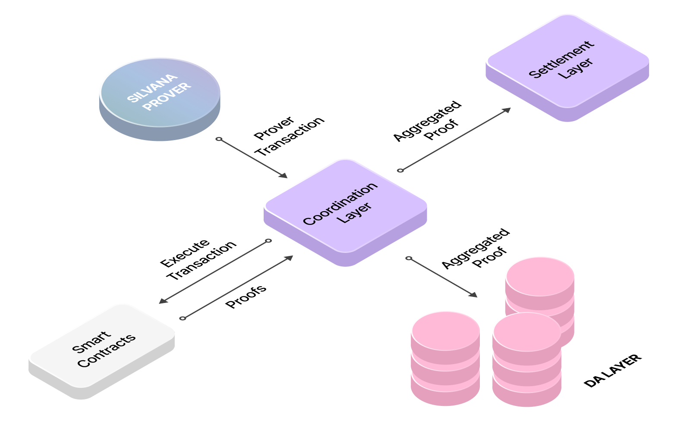

# Coordination Layer

Transactions involving [**zero-knowledge proofs (ZKPs)**](/Documentation/key-concepts/zk-proofs) are generally computationally heavy and, therefore, take longer time. That’s the reason why most ZK L1 or L2 projects lack scalability. Silvana built its **Coordination Layer** to ensure fast and secure transactions with ZKPs. 

Silvana’s Coordination Layer ​is a pivotal component that orchestrates the interaction between various modules and agents within its ecosystem. Its primary function is facilitating seamless communication and synchronization among components, ensuring tasks are executed coherently and efficiently throughout Silvana’s ecosystem.

## Functions

* **Transaction Acceleration**: Silvana leverages a fast L1 as the Execution Layer to achieve high transaction speeds. This environment allows for smart contract execution and real-time asset updates.
* **Proof Aggregation**: zk proofs are generated in the background and then recursively aggregated into a single proof that represents multiple operations. These batched proofs are later submitted as a single transaction to the **Settlement Layer**, which is a ZK-enabled blockchain.
* **Sequencing**: The Coordination Layer includes a built-in Sequencer that manages transaction ordering. This enables deterministic execution for use cases like **scheduled**, **prepaid**, and **event-triggered transactions**, which are foundational to Silvana’s automation and event-driven architecture.
* **Task Coordination**: the Coordination Layer acts as a mediator between modules and agents, facilitating the flow of information and commands. It ensures that agents representing users or automated processes interact correctly with the appropriate modules, maintaining the integrity and consistency of operations across the platform.

## Technical Flow

1. **Initiation**: an agent triggers a transaction (e.g., a scheduled payment or a compliance check).
2. **Ordering and Sequencing**: the Coordination Layer receives and queues the transaction based on priority or predefined logic.
3. **Execution**: he transaction is executed in the fast L1 **Execution Layer**.
4. **Generating Recursive Proofs**: the Coordination Layer aggregates multiple proofs into a recursive proof.
6. **Finalization**: The batched proof and state updates are submitted to the [**Settlement Layer**](/Documentation/architecture/Layers/settlement-layer) and stored in the [**Data Availability Layer**](/Documentation/architecture/Layers/data-availability-layer) for auditability.

By managing these interactions, the coordination layer facilitates efficient and secure operations, enabling developers to build complex applications without delving into the underlying cryptographic complexities.

