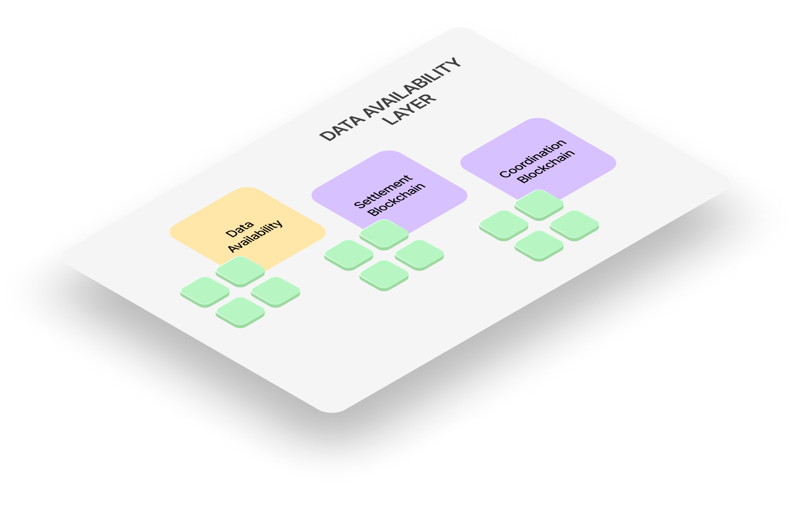

# Data Availability Layer

## Overview

The **Data Availability (DA) Layer** is essentially a **storage**. It securely stores all application data in structured [**data blobs**](/Documentation/glossary#data-blob) and ensures that any change to a record (whether a creation, mutation, or deletion) is **provable, traceable, and verifiable** using cryptographic proofs.

This layer is critical in maintaining **tamper-resistance**, **auditability**, and **compliance** without compromising privacy or performance.

## Core Functions

* **Provable Storage:** Silvana stores [**provable records**](/Documentation/key-concepts/provable-records) in the DA Layer. These records represent crypto or real-world assets and are encoded with mutable fields. Every action (creation, update, or deletion) on a record emits events and generates a [**Zero-Knowledge Proof (ZKP)**](/Documentation/key-concepts/zk-proofs) that is logged with the data mutation.

* **Proof of Availability:** The DA Layer does not merely store data — it cryptographically attests to the **availability and integrity** of that data.

* If data is **queried**, the system can generate a **proof of read**.
* If data is **mutated**, the system produces a **proof of change**.
* These ZK proofs ensure **verifiability without disclosing** the actual data, preserving confidentiality.

* **Immutable Commitments:** For each stored record or state change, a **commitment** is sent to the [**Settlement Layer**](/Documentation/architecture/Layers/settlement-layer) (L1 or L2 blockchain). 

This commitment represents the current state root of the rollup and ties together:

* The provable record’s state;
* Proof of change;
* DA hash (data location reference).

This model ensures **long-term data integrity** even if the DA layer is distributed across different storage providers.

## Unique Innovations

Silvana’s DA design extends beyond traditional blockchain storage:

* **Provable DB Transactions**: Every DB operation (read, write, delete) is provable. Unlike traditional databases, these interactions produce immutable cryptographic evidence of the operation.
* **Recursive Proof Compatibility**: ZK proofs of record changes can be **batched and aggregated** into recursive proofs for efficient verification and settlement.
* **Compliance-First Logging**: Ensures traceability for every transaction involving asset or record management — vital for industries like finance, insurance, and logistics.

Silvana is open to integrating with existing or emerging DA layers.

