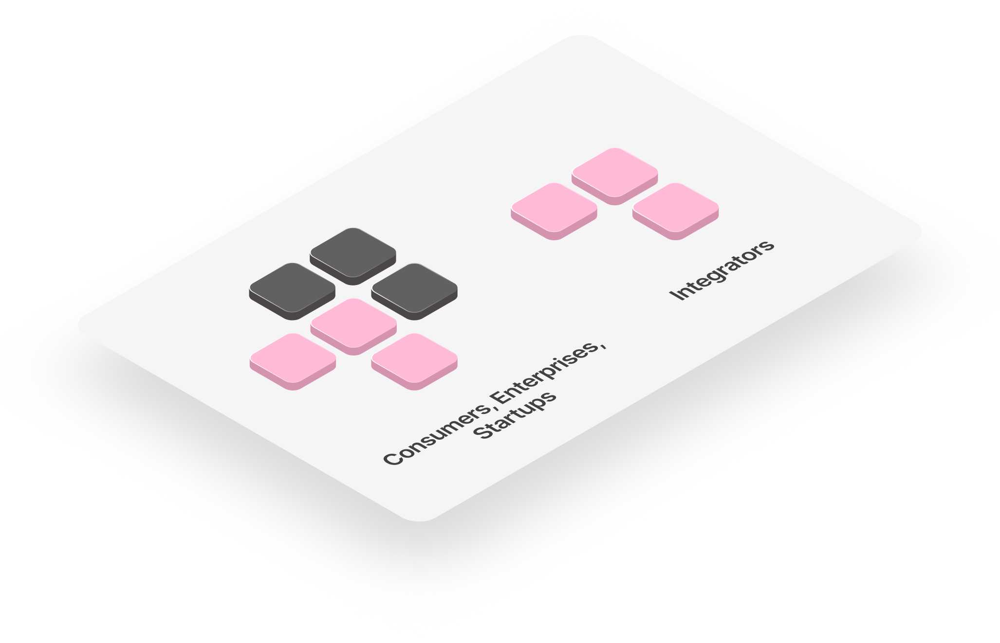

# Integration Layer

This is the highest-level layer, where consumers integrate what Silvana offers into their application architecture.

Silvana can be used by individual **enterprises** from different industries, **tech startups**, **industry integrators**, and other **consumers**. 

* Enterprises can integrate directly by using modules or Silvana Core in different execution environments, either by forking module repos in their private execution environment by using Silvana Cloud or developing their own modules to meet their business needs. 
* Companies can join Silvana via industry integrators - bigger aggregators with extensive experience and expertise in an industry (DeFis, accounting, audit, insurance, real estate, etc.). They can also use Silvana modules and Core or develop new modules themselves.

The Integration Layer supports Silvana’s broader mission to:

“**_Bridge corporate and crypto through a modular, scalable ZK proving engine that hides blockchain complexity and enables trustless business operations at scale._**”

By abstracting away the intricacies of ZK proofs and blockchain protocols, the Integration Layer empowers both newcomers and experts to deploy secure, scalable applications that meet the real-world needs of privacy, compliance, and performance.

