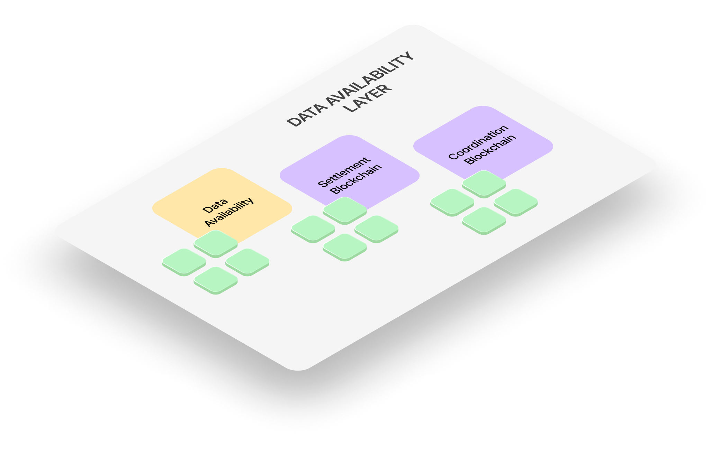

# Settlement Layer

The **Settlement Layer** is the lowest-level part of Silvana’s architecture. In other words, this is the blockchain layer, where transactions are signed by a set of validators to ensure transaction consistency and validity. As transactions are validated, they are added to an [**L1**](/Documentation/glossary#layer-1-l1) or [**L2**](/Documentation/glossary#layer-2-l2) blockchain. Keeping transactions on-chain ensures data security and consistency.

The Settlement Layer’s core functions include the following:

* **Transaction Finalization**: once transactions are executed in the execution layer, the Settlement Layer records them permanently, ensuring they cannot be altered or reversed. That’s when finality takes place. This provides users with confidence that their transactions are secure and final, meaning they cannot be mutated.
* **Proof Verification**: the Settlement Layer is responsible for verifying proofs submitted by rollups. This includes both fraud proofs (used in optimistic rollups) and validity proofs (used in zero-knowledge rollups). By validating these proofs, the Settlement Layer ensures that only legitimate transactions are confirmed.

## Strategic Role

By offloading execution to fast environments while securing finality on proven L1s, the Settlement Layer enables Silvana to combine:

* Ultra-fast application logic;
* Cryptographic correctness;
* Decentralized finality.

This hybrid strategy ensures that enterprise users benefit from **instant UX** at the application level, while also meeting **blockchain-grade expectations** for auditability, compliance, and integrity.

