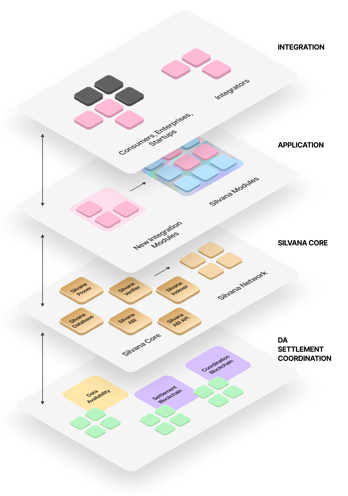

# Architecture Overview

## Overview

Silvana’s architecture reflects the complexity and comprehensiveness of the goals that Silvana is targeted at and must meet the high business requirements in scalability and security. All in all, it can be described as follows:

* **multi-tier** - there are multiple layers in Silvana's architecture, each having its own function.

* **modular** - by sticking to the modular design on the Application Layer, Silvana allows for arranging and deploying the code around particular practical, real-life use cases.

* **flexible** - the components of all architectural tiers can be deployed and used in multiple execution environments, which brings about flexibility in using Silvana.

* **business-oriented** - the architectural solution is designed in a way to empower developers to easily build apps based on business needs with all the technology complexities abstracted away and brought to lower levels.

* **chain-agnostic** - we do not focus on any particular blockchain, project, or cryptography; we can integrate with any L1, L2, DA, or Prover that supports ZKPs of any cryptographic function.

## Layers

Silvana platform comprises 4 layers. Here they are listed from the highest (business) level to the lowest (technical) level: 

* [**Integration Layer**](/Documentation/architecture/Layers/integration-layer) - deployment integration with end users;

* [**Application Layer**](/Documentation/architecture/Layers/application-layer) - basic Silvana and extended enterprise functions;

* [**Silvana Core**](/Documentation/architecture/silvana-core/) - proof generation and verification;

* [**Coordination**](/Documentation/architecture/Layers/coordination-layer), [**Data Availability**](/Documentation/architecture/Layers/data-availability-layer), and [**Settlement Layer**](/Documentation/architecture/Layers/settlement-layer) - fast transaction execution and proof aggregation, storing proofs and updating provable record states.

The diagram below illustrates Silvana’s architectural layers.

## Network Nodes

Generating proofs requires computational power, which in turn creates infrastructural demands. Silvana deploys a **network of prover nodes** that produce [**proof jobs**](/Documentation/glossary#proof-job) in exchange for rewards. This ensures decentralization and system robustness.

Apart from provers, Silvana Network can extend to the following types of nodes:

* **Data Availability & Mutable State Nodes** to manage decentralized data storage and dynamic updates governed by cryptographic proofs.

* **Distributed SQL Database Nodes** to provide standard SQL interfaces on top of the decentralized data and enforce cryptographic checks for data accuracy.

* **Staking Nodes** to let token holders stake their Silvana tokens, securing the network and earning rewards.

* **Restaking Nodes** to offer staking services for the Silvana Truth Marketplace, letting agents access shared staking pools for proof generation.

Each Silvana Network node may perform one or more roles in the ecosystem, either as private corporate infrastructure or as part of the public Silvana network.

## Execution Environments

Silvana offers flexible execution arrangements by providing multiple options for how different Silvana components can be deployed in each particular case by a user. The deployment can be done in various execution environments:

* [**Cloud Execution Environment**](/Documentation/Deployment/deployment-environments#cloud-execution-environment-cxe) - execution of Silvana functions in Silvana Cloud;

* [**Trusted Execution Environment**](/Documentation/Deployment/deployment-environments#trusted-execution-environment-tee) - execution of Silvana functions in the Trusted Enclave of the Silvana Cloud;

* [**Private Execution Environment**](/Documentation/Deployment/deployment-environments#private-execution-environment-pxe) - execution of Silvana functions in private infrastructure (cloud, servers).