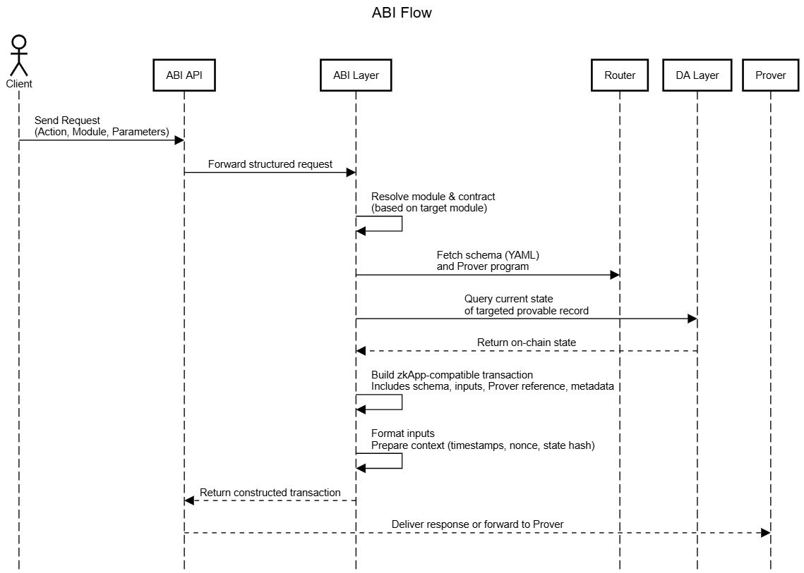

# ABI
## Overview

In Silvana, the **Application Binary Interface (ABI)** is a system-level service that builds transactions using module contracts and requested parameters. 

The **ABI API** exposes this capability to external systems and developers. It allows clients to send intent-based requests (e.g., "deploy token") which ABI transforms into fully constructed transactions ready for proof generation and blockchain submission.

The ABI does **not** execute or submit transactions. Instead, it acts as a **transaction constructor**, taking abstract instructions and transforming them into valid zkApp-compatible transaction payloads.

## ABI Responsibilities

The ABI is responsible for:

* **Resolving the correct smart contract** from a requested module
* **Building a transaction object** based on frontend inputs and module definitions
* **Formatting the transaction** in accordance with ZK-friendly standards (compatible with Prover Program)
* **Passing the built transaction** to other components (e.g., Prover, Tx Sender)

It serves as the glue between high-level API calls and the underlying module implementations.

> “**API** sends the request, **ABI** builds the transaction”.


## Purpose and Usage

The **ABI** in Silvana is implemented as a modular, server-side component that can be accessed via a REST interface. It is designed to be agnostic to execution environments and pluggable into any Silvana-compatible module or external service. 

Its role is to act as the **transaction construction gateway** - receiving intent from clients and building fully structured, ZK-compatible transactions.

### Workflow

1. **Request Intake**

A request from the frontend or external client is sent via API. It includes:

* Action type (`create`, `transfer`, etc.)

* Target module (`fungible-token`, `marketplace`, etc.)

* Parameters (token ID, recipient, etc.)

2. **API → ABI Forwarding**

API forwards the structured request to ABI. API does not interpret business logic.

3. **Module and Contract Resolution**

ABI identifies the relevant contract interface and logic from the specified module.

4. **Schema and Prover Program Retrieval**

ABI fetches the schema (YAML-based) and links to the Prover Program via the Router. This defines allowed transitions and input types.

5. **State Verification via DA Layer**

ABI queries the Data Availability layer to fetch the current state of the targeted provable record. It checks consistency with on-chain state.

6. **Transaction Construction**

ABI builds a zkApp-compatible transaction:

* Includes schema, inputs, metadata, and Prover Program reference

* Formats inputs for the Prover

* Prepares transaction context (timestamps, nonce, record state hash)

7. **Transaction Return**

The built transaction is returned to the API or passed to the next layer (Prover). ABI’s role ends here.

See how ABI flow looks like:



### Example
This example constructs a transaction to deploy a new fungible token in JSON:
```JSON
schemas:
  - id: "user.trading.account"
    version: 1
    fields:
      baseTokenBalance: TokenBalance
      quoteTokenBalance: TokenBalance
      bid: Order
      ask: Order
      nonce: bigint
    ProverProgramId: "trading.ProverProgram.v1"
```
**Explanation of Fields**:

* `module`: Target logic module (must be registered in Silvana Core)

* `action`: Requested operation within the module

* `params`: Action-specific inputs, matched against the contract interface

* `meta`: Optional context metadata

     * `timestamp`: Client-side request time (used in transaction context)

     * `network`: Network ID or alias

     * `ProverProgram`: Optional ProverProgram version or identifier to resolve

**Output**:

ABI produces a complete transaction object ready for:

* Zk-proof generation (by **Prover**)

* Blockchain submission (by **Tx Sender**)

### Additional Features

* Works across modules using standard interfaces

* Uses contract metadata but does not execute it

* Supports plugins for ABI Explorer interfaces

* Used in **PXE**, **CXE**, and **TEE** environments