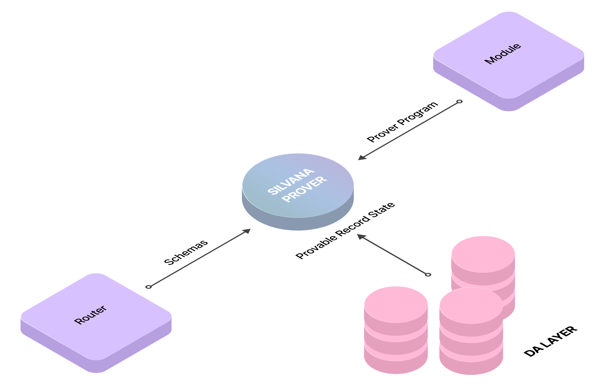
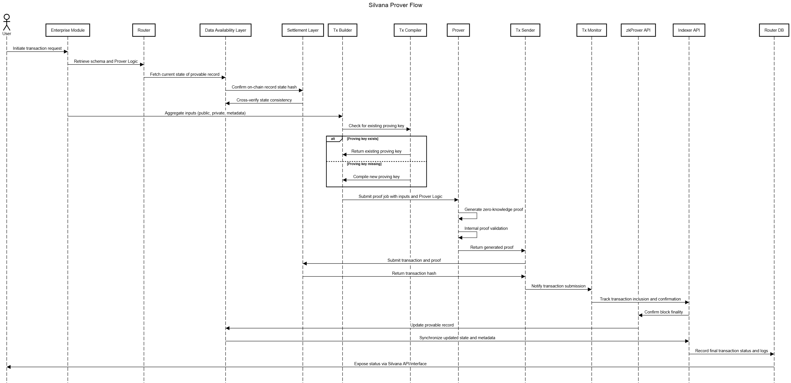

# Prover
## Overview
The Silvana Prover is designed to generate [**zero-knowledge proofs (ZKPs)**](/Documentation/about-silvana/key-concepts/zk-proofs) that confirm the validity of statements or transitions in Provable Records while preserving the confidentiality of the underlying sensitive information (**Private Input**).

Its functionality is essential, like the engine in a car, making it a critical driver of the entire system. Without a prover, the purpose and functionality of Silvana are fundamentally compromised. Utilizing zero-knowledge technology, Silvana ensures secure and private transactions without compromising data integrity or compliance.

## Prover Function
The Prover is responsible for performing the Prover Function (Circuit). It retrieves a **schema** from the [**Router**](/Documentation/architecture/silvana-core/router), the **Prover Program** (logic) from the corresponding **module**, and the current **state** of **provable records** from the **Data Availability (DA) layer**. It then processes the collected inputs according to the **Provable Program** logic, executing cryptographic operations to generate proofs. These proofs cryptographically confirm the correctness and compliance of the state transitions without disclosing any private details.

```typescript
async function generateProverProof(privateInput, publicInput, ProverProgram) {
  const proverKeys = await generateProverKeys(ProverProgram);
  const proof = await ProverProgram.execute(privateInput, publicInput, proverKeys);
  return proof;
}
```


## How Prover Works

The Silvana Prover details a structured approach to generating and managing zero-knowledge proofs (ZKPs), ensuring secure and confidential verification of state changes without revealing sensitive data. These proofs are securely stored and submitted to the blockchain for validation and settlement. The flow also covers proof reservation, merging proofs for efficiency, and managing on-chain settlements, ensuring robust and compliant proof handling within the Silvana system.

This is the common prover flow:

1. **Transaction Request Initialization**

A user or enterprise module initiates a transaction involving a **provable record**.
Inputs provided:
* **Private input** (e.g., sensitive business data),
* **Public input** (e.g., record hash, timestamp),
* **Signature** authenticating the initiator.
* The transaction intent is defined (e.g., create, update, verify).

2. **Schema & Logic Resolution**

The **Router** is queried to retrieve:
* The **schema** of the provable record,
* The corresponding **Prover Program**, which defines rules and constraints for proof generation.

3. **State Fetching from DA Layer**

The **Data Availability (DA) Layer** is queried to fetch:

* The current state of the provable record,
* Record availability and validity for mutation.

4. **State Confirmation on Blockchain**

The **Settlement Layer** is queried to:

* Confirm the on-chain record state hash,
* Cross-verify with the DA layer for consistency.

5. **Input Aggregation**

The system gathers:

* All **public inputs** (e.g., hashes, Merkle roots),

* All **private inputs** (e.g., sensitive values, metadata),

* Any record-specific logic metadata from the Prover Program.

6. **Prover Program Compilation**

The **ABI** loads and compiles the required **Prover Program** module. This produces:

* Executable constraint logic,
* Valid state transition rules embedded in the proof circuit.

7. **Proof Job Construction**

The **Tx Builder** assembles a job with:

* Input data,
* Compiled Prover Program ID,
* Record metadata.

The job is submitted to the **Prover**.

8. **Proving Key Handling**

The **Tx Compiler** checks for an existing **proving key** for this logic.

* If absent, it compiles a new key.
* Keys are reused when possible to optimize performance.

9. **Zero-Knowledge Proof Generation**

The **Prover** runs the **Prover Program** with:

* Public and private inputs,
* The proving key.

It produces a **zero-knowledge proof** that confirms valid state mutation without revealing private data.

For multi-record transactions, **recursive proofs** are composed.

10. **Internal Proof Validation**

The **Prover** checks:

* Integrity of the generated proof,
* Optional internal verification before submission.

11. **Transaction Assembly**

The **Tx Sender** packages:

* The proof,
* Public inputs,
* Prover Program hash and metadata,
* Required execution details.

This creates a blockchain-ready transaction bundle.

12. **Submission to Blockchain**

* The transaction and proof are submitted to the **Settlement Layer**.

* A **transaction hash** is generated and returned by the blockchain.

13. **Monitoring & Verification**

The **Tx Monitor**:

* Uses the **Indexer API** to track transaction inclusion and confirmation,
* Detects block finality.

14. **Post-Proof State Mutation**

 Once confirmed:

* The **zkProver API** updates the **provable record** in the **DA Layer**,
* Synchronizes the updated state and metadata in the **Indexer database**.

15. **Final State & Audit Logging**

 The **Router database** records:

* Final transaction status,
* Proof references,
* Prover Program metadata,
* Mutation and audit logs.
* The status is exposed to the user/system via the **Silvana API** or interface.

The diagram below illustrates the prover flow.




## Integration and Compatibility

Silvana Prover operates within a flexible, modular architecture compatible with various execution environments (**PXE**, **CXE**, **TEE**) and blockchain networks (**L1**, **L2**). It is blockchain-agnostic, supporting multiple chains, too.

Silvana Prover works with various ZKP cryptographic systems and functions including but not limited to Kimchi, Groth16, Blake2. It also supports recursive proof functions like Pickles.

> **Terms**  
>
> **Recursive Proof** - a special type of zero-knowledge proof that can verify other zero-knowledge proofs — including itself.

## Prover Operations Handling

The Silvana Prover manages ongoing operations to ensure optimal resource utilization and consistent transaction processing:

* **Concurrent Processing**: The Prover can execute **multiple proof-generation tasks** in parallel, maximizing CPU usage and preventing a single slow job from blocking others.

* **Isolation and Sandboxing**: Tasks run in a **self-contained environment**, safeguarding private data and preventing any cross-interference among concurrently running proof jobs.

* **Job Scheduling & Queue Management**: It queues incoming proof requests, prioritizes them, and distributes tasks to worker processes for efficient, fair handling of both high-priority and routine jobs.

* **Resource & Memory Management**: The Prover monitors and limits CPU/memory consumption per job, recycling resources between tasks to avoid runaway usage or system instability.

* **Error Detection & Recovery**: On encountering validation or runtime errors in a proof job, the Prover aborts the task gracefully, logs the issue, and isolates the failure so other operations remain unaffected.

* **Automated Retries**: Transient or minor failures prompt the Prover to retry the proof generation automatically, ensuring robust handling of temporary glitches without manual intervention.

* **Extensive Logging**: Each proof operation is recorded, capturing start/stop events, execution times, and any exceptions, enabling in-depth auditing, debugging, and performance tuning.

* **Real-Time Monitoring**: The Prover exposes performance metrics (like queue lengths, average proving time) to external systems, giving operators insight into throughput and potential bottlenecks.

* **Proof Batching & Aggregation**: Multiple smaller proofs can be combined into a single job or merged into a recursive proof, boosting efficiency by reducing duplicated cryptographic overhead.

* **Validation & Consistency Checks**: The Prover often verifies the generated proof internally before submission, guaranteeing correctness and preventing invalid proofs from being dispatched.

* **Integration with Tx Sender & Monitor**: Once a proof is generated, it's handed off for transaction packaging and blockchain submission; status updates are then communicated back to the Prover framework.


