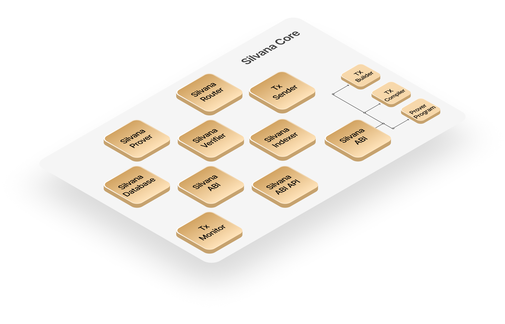

# Silvana Core Overview

## Silvana Core Components

**Silvana Core** is the key layer where proofs are generated and verified. This is exactly where all Silvana magic unfolds. Silvana Core includes the following components:

* **Prover**: generates ZK proofs based on provable record state changes.
* **Verifier**: independently verifies generated ZK proofs.
* **Database**: stores ZK proofs and provable records.
* **Router**: provides schemas and zkPrograms for proofs.
* **ABI (Application Binary Interface)**: builds, compiles, sends, and monitors transactions.
* **ABI API**: facilitates transaction data retrieval.
* **Indexer**: aligns and indexes transaction data.
* **Tx Monitor**: monitors transaction statuses.
* **Tx Sender**: sends transactions to blockchain networks.

## Prover and Verifier Functions (Circuits)

Silvana Core runs two Circuits in a ZKP transaction: the **Prover Function (Circuit)** and the **Verifier Function (Circuit)**. These processes involve 2 basic components: the Prover and the Verifier.

**Prover**: This component generates a **zero-knowledge proof (ZKP)** that validates the state and behavior of a **Provable Record**. The Prover queries the **Router** to get the **Prover Program** and the schema for a provable record. Then the Prover queries the DA to get the current state of the provable record. The Prover generates proof based on the Prover Program and the current state of the provable record and mutates its state, which is subsequently recorded in the Database. There can be multiple proofs in one transaction if it involves multiple provable records. Such proofs are wrapped in a **recursive proof**.

**Verifier**: it is the component that checks the generated proofs on the verifier’s (counterparty’s) side (the **Verifier Circuit**). The Verifier queries the Router to get the Prover Program and the schema for a provable record. Then the Verifier gets proofs from the Prover and verifies them according to the zkProgram. If the proof is valid, the Verifier writes the mutates state of the provable record in the Database.Without accessing the underlying data, the Verifier ensures that the Provable Record adheres to the established schema and behavior, maintaining trust and privacy within the system.

> **Terms**  
>
> * **Zero-knowledge proof (ZKP)** - a cryptographic protocol that allows one party (a prover) to demonstrate to another party (a verifier) that a specific statement is true without revealing any underlying information. The Verifier is convinced of the claim's truthfulness but gains no additional knowledge beyond its validity.
> 
> * **Recursive Proof** - a special type of zero-knowledge proof that can verify other zero-knowledge proofs — including itself.
> 
> * **Prover Function (Circuit)** - the function allowing one party (the prover) to demonstrate to another party (the verifier) that they possess certain information without revealing the actual data itself.
> 
> * **Verifier Function (Circuit)** - the function allowing one party (the validator) validate the proof provided by another party (the prover) without gaining access to the actual information being proved.
> 
> * **Router** - an interface for users to interact with provable records. It contains schemas of provable records as a Yaml file containing its fields.
> 
> * **Prover Program** - the business logic that rules how a proof has to be generated and verified.

That’s how it works:

1. Enterprise Manager initiates a transaction by providing the Private and the Public Input.
2. Prover generates proof.
3. Verifier verifies proof.
4. ABI builds a transaction that is sent to the L1/L2 blockchain. 
5. The provable record gets created or mutated in the DA Layer.

The diagram below illustrates the prover flow.
