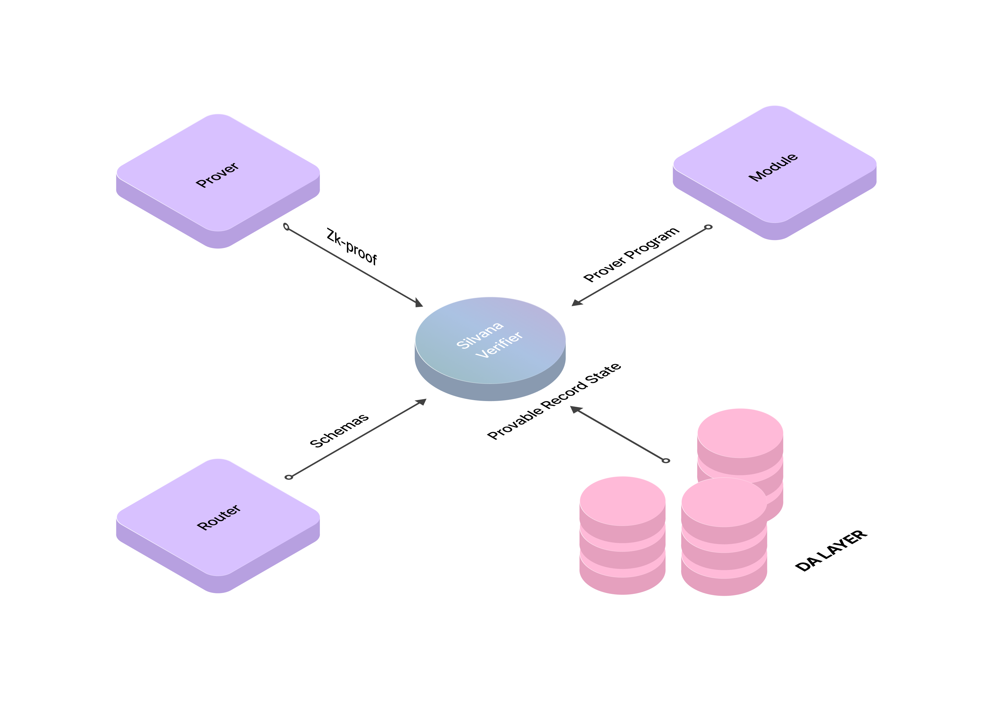
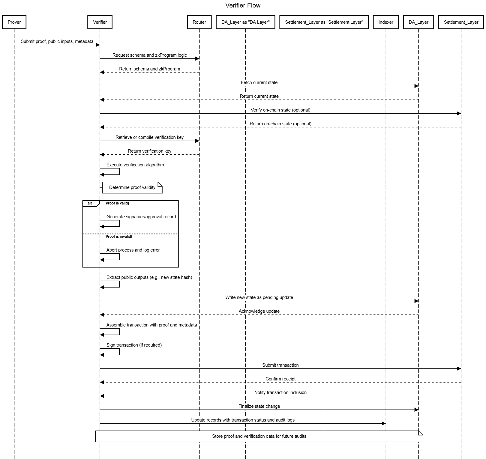

# Verifier

## Overview

​The **Silvana Verifier**, along with the [**Prover**](/Documentation/architecture/silvana-core/prover), is a component of the [**Silvana Core**](/Documentation/architecture/silvana-core/) independently validating zero-knowledge proofs to ensure the correctness of state transitions. Operating solely on the **Public Input** and cryptographic keys, it maintains data confidentiality while enabling trustless verification, allowing any participant to confirm transaction validity without intermediaries.​

Anytime using the Verifier, a user can check that the generated proof is valid. **Without a Verifier, Silvana’s zero-knowledge guarantees would be meaningless** – any invalid or malicious proof could slip through.

## Verifier Function

​The Verifier executes the **Verifier Function (Circuit)** to validate [**zero-knowledge proofs (ZKPs)**](/Documentation/key-concepts/zk-proofs) each time a [**provable record**](/Documentation/key-concepts/provable-records) is **created** or **mutated**. It receives a proof from the Prover, along with the Public Input (e.g., hashes, commitments, timestamps), and uses the verification key to confirm the proof's integrity. The Verifier retrieves the necessary **schema** from the [**Router**](/Documentation/architecture/silvana-core/router) and the Prover Program from the corresponding module, ensuring alignment with the Prover's parameters. The verifier queries the provable record state in the [**DA Layer**](/Documentation/architecture/Layers/data-availability-layer). Operating solely on public data, it employs cryptographic algorithms to ascertain that the proof corresponds to the correct processing of private inputs.

The diagram below illustrates how the Verifier works.



Pseudocode for the Verifier’s operation might look like this:

```typescript
interface ProverProgram {
  getVerificationKey(): Promise<VerificationKey>;
  verify(proof: Proof, publicInput: PublicInput, vKey: VerificationKey): boolean;
}

interface VerificationKey {
  // Cryptographic verification key parameters
}

interface Proof {
  // Zero-knowledge proof data structure
}

interface PublicInput {
  // Public inputs for verification
}

async function verifyProof(
  proof: Proof,
  publicInput: PublicInput, 
  ProverProgram: ProverProgram
): Promise<boolean> {
  // Retrieve or compute the verification key for the given ProverProgram
  const vKey: VerificationKey = await ProverProgram.getVerificationKey();
  
  // Cryptographically verify the proof against the public input and verification key
  const isValid: boolean = ProverProgram.verify(proof, publicInput, vKey);
  
  return isValid;
}
```

If **_`isValid`_** comes out true, the proof is genuine and the proposed state transition can be accepted; if false, the proof (and its transaction) is rejected. This process is extremely fast compared to proof generation and takes only milliseconds.

## Verifier Flow

This is what the Verifier flow looks like:

1. Proof Reception

* Receive proof, public inputs, and metadata from the Prover.
* Identify the associated Prover Program/module.​

2. Schema & Program Retrieval
* Query the Router to obtain the schema and Prover Program logic.
* Ensure alignment with the Prover's parameters.​GitHub

3. State Consistency Check
* Fetch current state from the Data Availability (DA) layer.
* Confirm that the state matches the Prover's reference.
* Optionally, verify consistency with the Settlement layer.​

4. Verification Key Initialization
* Load or compile the verification key for the Prover Program.
* Utilize cached keys when available to optimize performance.​

5. Proof Verification Execution
* Execute the verification algorithm using the proof, public inputs, and verification key.
* Determine the validity of the proof.​

6. Proof Validation & Sign-off

* If valid, proceed; if invalid, abort and log an error.
* Optionally, generate a cryptographic signature or approval record.​

7. Public Output Extraction

* Extract public outputs from the proof, such as new state hashes.
* Prepare data for state update.​

8. State Update in DA Layer
* Write the new state to the DA layer as a pending update.
* Store the proof and verification result for audit purposes.​

9. Transaction Assembly
* Assemble a transaction containing the proof, public inputs/outputs, and references.
* Sign the transaction if required.​

10. Submission to Settlement Layer
* Submit the transaction to the Settlement Layer (L1/L2 blockchain).
* Depending on the mode (ZK-Rollup or Optimistic/Hybrid), the chain may verify the proof or accept it based on off-chain validation.

11. Confirmation and Finalization
* Monitor the Settlement chain for transaction inclusion and confirmation.
* Finalize the state change in the DA layer upon confirmation.
* Update records in the Indexer and Router databases.

12.Audit and Availability
* Ensure that the proof and its verification are recorded for future independent verification.
* Support verification of complex transactions, including recursive or batched proofs.

