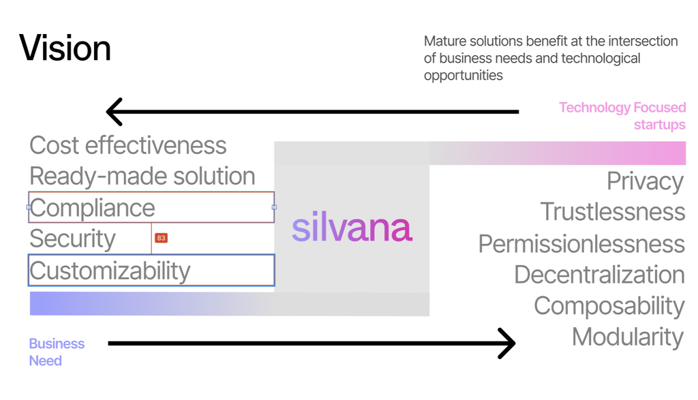
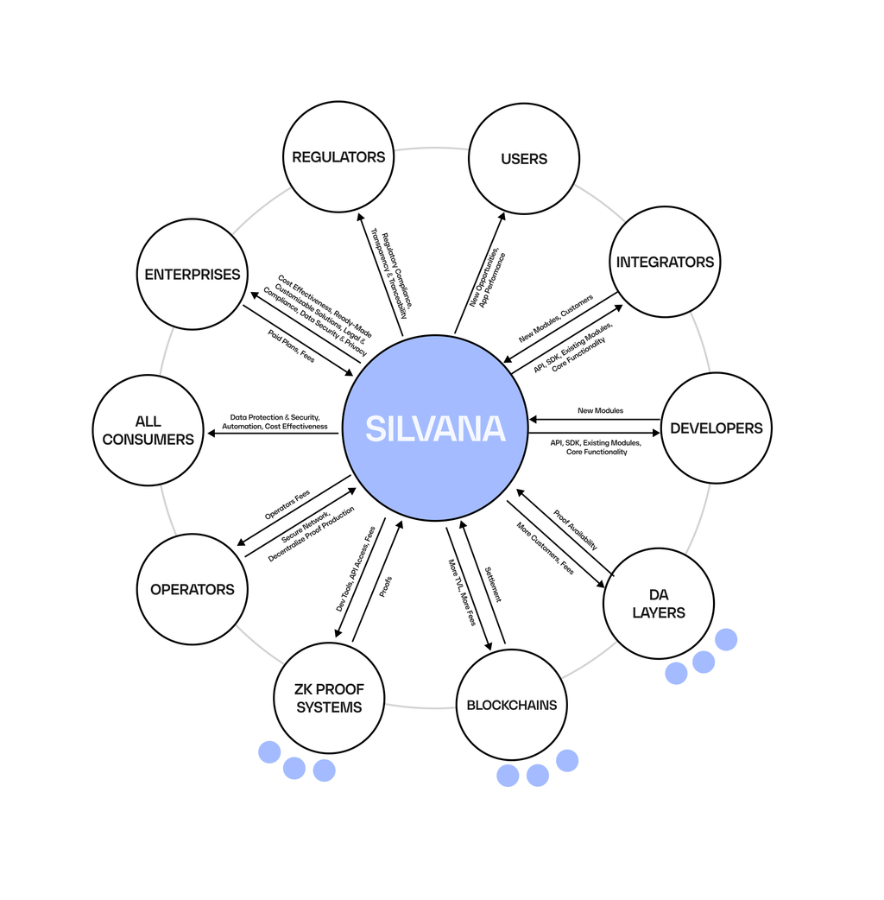

# Business Context

## Our Mission

We aim to revolutionize on-chain asset management by leveraging advanced zero-knowledge (ZK) proofs for robust data privacy. We address trust, security, and efficiency challenges in fragmented, opaque markets by integrating ZK and blockchain technology into a seamless, enterprise-ready platform. Our ultimate mission is to catalyze a 1000× expansion of blockchain and ZK technologies worldwide.

## Vision & Opportunity

> "Midway upon the journey of our life,  
> I found myself within a forest dark,  
> For the straightforward pathway had been lost."  
> – Dante Alighieri

**Vision**: Empower businesses to conduct transactions, confidently verify, and report effectively using ZK-enabled blockchain solutions. These solutions preserve privacy, reduce operational overheads, and create new revenue streams.

**Opportunity**: As privacy regulations tighten and trustless processes gain traction in supply chains, finance, insurance, and beyond, the demand for cryptographic verification without data leakage is growing. Traditional solutions often fall short, requiring businesses to expose more data than necessary. Silvana's privacy-first approach fills this gap, unlocking the potential for 1000× market growth in ZK and blockchain technology.

Silvana aims to bring the light in that forest of complexity, offering a scalable, privacy-centric engine for modern enterprises while shielding them from the intricacies of blockchain.

## Problem Statement

### No Viable Web3 Private Data Verification Solution

- Current L1 and L2 blockchains are not hardwired to handle private data within real-world enterprise infrastructure
- Traditional verification involves extensive data sharing, manual checks, and dependence on third-party intermediaries, resulting in high costs, security breaches, compliance issues, and inefficiencies
- Existing solutions contain a lot of ZK complexities that must be abstracted away to get the focus on business needs and applications

### Too Much Focus on Technology Over Business

Many tech startups prioritize ZK technology and issues like data privacy and decentralization, while businesses need:

- Compliance
- Cost-effectiveness
- Development speed
- Data security
- Customizability

### No Comprehensive Package ZK Solution

Despite its strong utility, ZK technology still lacks a comprehensive integrative product that covers most use cases for private and secure data and proof verification.

### Project Isolation

Projects, especially those involving ZK proof systems, are typically deployed on individual networks, rendering them blockchain-specific and isolated.

### Additional Challenges

**Compliance Issues**

- Maintaining regulatory standards can be onerous
- Businesses risk exposing proprietary data in compliance, lacking the private data proving needed for truly trustless solutions

**Legacy Infrastructure**

- Outdated, siloed systems slow down verification, hamper collaboration, and inflate costs
- Manual or double-entry processes remain vulnerable to fraud and errors

## Value Proposition

Our customers and primary beneficiaries are standalone enterprises and industry integrators, including startups specializing in on-chain asset management and RWAs. Our solution will also benefit blockchain ecosystems and regulators.

### Enterprises

Digital and off-chain enterprises use Silvana to manage their assets, either directly or through integrators. They benefit from:

- Improved cost-effectiveness by automating and tokenizing their assets
- Ready-made, customizable solutions to meet their business needs
- Ensured legal compliance
- Guaranteed data security and privacy
- Cross-chains transactions

### Integrators and Developers

Integrators are key players that aggregate enterprises and cater to their needs. With their expertise, they act as intermediaries between enterprises and Silvana. They benefit from:

- A ready-made, customizable module solution
- Fast and easy onboarding, thanks to well-packaged modules, API, and SDK for building applications with ZK proofs
- The ability to deploy solutions on any blockchain, in any environment, and with any technology due to complexity abstraction and a blockchain-agnostic approach
- An expanded customer base among enterprises, leading to a more extensive portfolio

### Blockchain Ecosystem

Silvana significantly benefits four key actors in blockchain systems:

**Settlement Layer (L1, L2) Blockchains:**

- Increased transaction activity
- Higher Total Value Locked (TVL)
- More transaction fees paid

**Data Availability (DA) Layer:**

- Enhanced data recording
- Increased storage fees paid

**ZK Proof Systems:**

- Integration capabilities
- Development tools
- API access

**Blockchain Users:**

- Expanded functionality
- Improved asset ownership and management
- Ensured data privacy and security

### Regulators

Regulators and government agencies ensuring compliance with asset management laws benefit from:

- Guaranteed legal compliance
- Enhanced transaction transparency and traceability

The diagram below provides a clear and comprehensive overview of Silvana's advantages for different stakeholders in the blockchain ecosystem.

