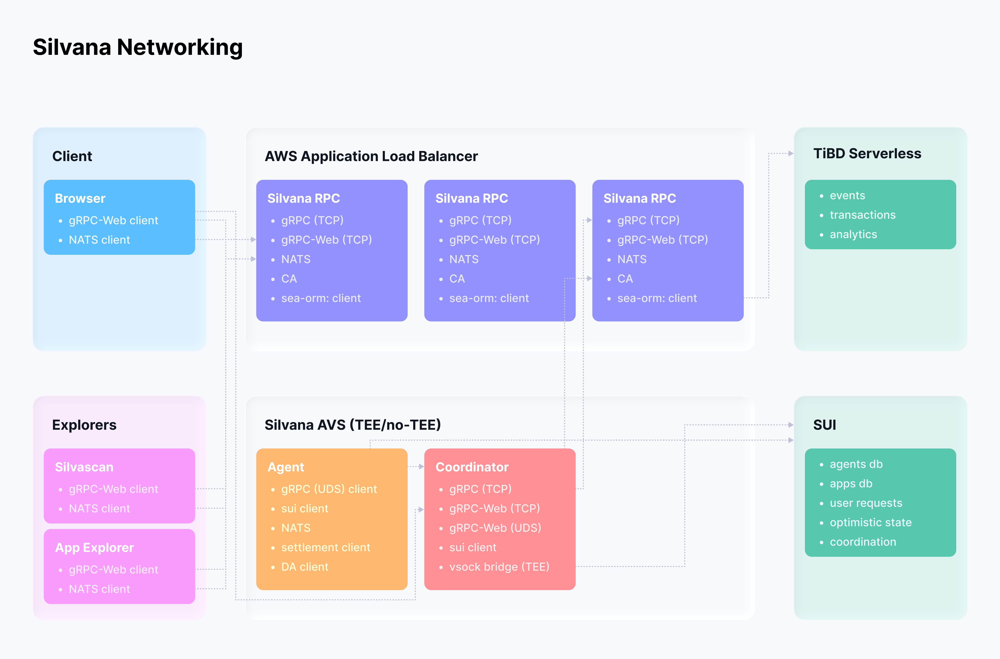

# How to Add a Node

## Silvana Node
Silvana’s infrastructure relies on a network of nodes assigned to perform the following functions:
- Coordination of proving and execution for Silvana apps;
- Ensuring Silvana OS interface availability via gPRC locally for running agents;
- Monitoring proof jobs, app operation, logs and metrics via OpenTelemetry gRPC push to New Relic.

## Hardware requirements
These are the recommended performance requirements for a Silvana node.

| **Minimal Hardware Requirements** | **Optimal Hardware Requirements** |
|----------------------------------|-----------------------------------|
| <ul><li>8 CPU</li><li>16 GB RAM</li><li>100 GB disk to hold docker images of the agents</li></ul> | <ul><li>16–32 CPU</li><li>32–64 GB RAM</li><li>200 GB disk to hold docker images of the agents</li></ul> |

## Installation Guide
There are two ways you can install a node: **Quick Installation** (recommended) and **Manual Installation**.

### Quick Installation
Install the latest version of Silvana with a single command:

```bash script
curl -sSL https://raw.githubusercontent.com/SilvanaOne/silvana/main/install.sh | bash
```
Or with wget:

```bash script
wget -qO- https://raw.githubusercontent.com/SilvanaOne/silvana/main/install.sh | bash
```
This script will:

- Automatically detect your OS (Linux or macOS) and architecture (ARM64 or x86_64);
- Download the appropriate binary from the latest GitHub release;
- Install it to `/usr/local/bin/silvana;`
- Verify the installation.

Supported Platforms:
- Linux ARM64 (aarch64);
- Linux x86_64 (amd64);
- macOS Apple Silicon (M1/M2/M3/M4).

### Manual Installation
If you choose to install manually:

1. Go to the [releases page](https://github.com/SilvanaOne/silvana/releases).
2. Download the archive suitable for your platform:
 - `silvana-arm64-linux.tar.gz` for Linux ARM64;
 - `silvana-x86_64-linux.tar.gz` for Linux x86_64;
 - `silvana-macos-silicon.tar.gz` for macOS Apple Silicon.
3. Extract and install using these commands:

```bash script
# Download (replace with your platform's file)
curl -LO https://github.com/SilvanaOne/silvana/releases/latest/download/silvana-arm64-linux.tar.gz

# Extract
tar -xzf silvana-arm64-linux.tar.gz

# Install
sudo mv silvana /usr/local/bin/

# Make executable
sudo chmod +x /usr/local/bin/silvana

# Verify
silvana --version
```
4. To install a specific version instead of the latest one, run this command:
```bash script
curl -sSL https://raw.githubusercontent.com/SilvanaOne/silvana/main/install.sh | VERSION=v0.1.0 bash
```
5. After installation, verify the version works by doing this:

```bash script
silvana --version
silvana --help
```
### Uninstall
To remove Silvana, run this command:

```bash script
sudo rm /usr/local/bin/silvana
```

### Troubleshooting
Below are the most common issues you may encounter, along with the ways to address them.

#### Permission Denied
If you get a permission error, make sure the binary is executable:

```bash script
sudo chmod +x /usr/local/bin/silvana
```
#### Command Not Found
If `silvana` is not found after installation, add `/usr/local/bin` to your PATH:

```bash script
export PATH=$PATH:/usr/local/bin
echo 'export PATH=$PATH:/usr/local/bin' >> ~/.bashrc  # or ~/.zshrc
```
#### SSL/TLS Errors
If you encounter SSL errors during download, you can use the insecure flag (not recommended for production):

```bash script
curl -sSLk https://raw.githubusercontent.com/SilvanaOne/silvana/main/install.sh | bash
```
## Running Silvana Node

After installation, you’re ready to run the app.
To start a Silvana coordinator node, run this:

```bash script
silvana start
```

This command will:
- **Fetch configuration** from the Silvana RPC server for your network (devnet by default);
- **Auto-generate Sui keypair** if not present (saved to `.env`);
- **Request funds** automatically from the devnet faucet (10 SUI);
- **Initialize services** including job searcher, Docker processor, and gRPC server;
- **Launch monitoring** for jobs on the blockchain.

### First-Time Setup
If you’re running silvana start for the first time, follow these steps:

1. Enter this command:

```bash script
🔄 Fetching configuration for chain: devnet
✅ Successfully fetched 16 configuration items
🔑 SUI credentials not found, generating new keypair...
✅ Generated new Sui keypair:
   Address: 0x3f176926a223d730fea3998da1791f4c7517e73bf3472e233a316d8672275683
📝 Saved credentials to .env file
💰 Requesting funds from devnet faucet...
✅ Faucet request successful!
   Transaction: GGRwF1ybif9nRsjiJEneBguQppzKLkWVzxSZmToj1mLH
   🔗 Explorer: https://suiscan.xyz/devnet/tx/GGRwF1ybif9nRsjiJEneBguQppzKLkWVzxSZmToj1mLH
```
2. Specify the network you’re about to use:

```bash script
# Devnet (default)
silvana start --chain devnet

# Testnet
silvana start --chain testnet

# Mainnet
silvana start --chain mainnet
```

3. If you have existing Sui credentials, create a .env file:

```bash script
# .env
SUI_ADDRESS=0x...your-address...
SUI_SECRET_KEY=suiprivkey1...your-private-key...
SUI_CHAIN=devnet
```

4. To join a specific Silvana registry (e.g., shared devnet), run this command:

```bash script
# Get the shared devnet registry
silvana config

# Add to your .env:
SILVANA_REGISTRY=0x916a3b24de8165fb6fb25d060ec82b50683dc9e9cebf0dfae559f943ee32adb2
SILVANA_REGISTRY_PACKAGE=0x32f8ad21df94c28401912c8ffebcc3bd186f5bf7da0995057a63755005937025
```

5. Process all jobs from your registry:

```bash script
silvana start
```

6. Process jobs only from a specific app instance:

```bash script
silvana start --instance 0xaacf350ac6ae669ebf9804b455b0bc75a71f28a34bdc48d87ca78f1f90ba0f3b
```

7. Run as a dedicated settlement node:

```bash script
silvana start --settle
```

During the startup, the coordinator performs these initialization steps:

1. **Configuration Loading**: fetches and injects environment variables from RPC server.
2. **Sui Connection**: connects to the Sui blockchain RPC endpoint.
3. **Balance Check**: verifies sufficient SUI balance for operations.
4. **Gas Coin Pool**: splits large coins into smaller ones for better transaction performance.
5. **Service Startup**:
   - **Job Searcher**: monitors blockchain for new jobs.
   - **Multicall Processor**: batches operations for efficiency.
   - **Docker Buffer**: manages container execution.
   - **Event Monitor**: watches blockchain events.
   - **gRPC Server**: provides API for agent communication.
   - **Periodic Tasks**: ensures reconciliation, block creation, proof analysis.

### Monitoring

Once running, you'll see logs indicating job processing:

```bash script
📝 JobCreated: seq=4, dev=AddDeveloper, agent=AddAgent/prove, app_method=add
🐳 Starting Docker container for buffered job 1: AddDeveloper/AddAgent/prove
✅ Job 1 started and reserved for Docker session
```

#### Troubleshooting
The coordinator may fail to start for a number of reasons. This is what you can do in each of these situations:

- Missing credentials: will auto-generate on devnet, or check your `.env` file.
- Insufficient balance: run `silvana faucet sui --address 0x...`.
- Connection issues: verify network connectivity to RPC endpoints, gRPC TCP protocol is used for connection that requires streaming support and a continuous TCP connection.
- Docker errors: ensure Docker daemon is running.
- Registry not found: check `SILVANA_REGISTRY` and `SILVANA_REGISTRY_PACKAGE` values.

### Next Steps

After starting your Coordinator, do this:
1. **Create a new project**: `silvana new myproject`.
2. **Deploy an application**: follow the [Add Example](https://github.com/SilvanaOne/silvana/blob/main/examples/add/README.md).
3. **Monitor jobs**: use `silvana jobs --instance <your-app-instance>`.
4. **Check balances**: `silvana balance sui`.

For detailed application development, see the [examples documentation](https://github.com/SilvanaOne/silvana/blob/main/examples/add/README.md).

## Features
This is what you have with Silvana:

- gRPC server and client: gRPC, gRPC-Web;
- TiDB Serverless database: store events, query, fulltext search;
- NATS JetStream on nats and wss;
- Internal buffering in memory for batch processing;
- Protobuf definitions and reflection on endpoint and in Rust code;
- Monitoring: logs to file/console, logs/metrics via OpenTelemetry gRPC push/REST pull, Grafana/Prometheus/BetterStack support for logs and dashboards.

The diagram below illustrates the Silvana Networking architecture.


## Performance
The table below features how Silvana performs:

| **Indicator** | **Value** |
|----------------|------------|
| Responce time for any operation, including adding event, query event, fulltext search | 100–200 |
| Events per second | 10,000 |
| Low-load RAM consumption | 200 MB |
| High-load RAM consumption (1 mln events) | 300 MB |
| CPU load | <20–30% on thousands of events per second |

## Deployment
To deploy an app, follow the instructions below.

1. Cross-build Rust executable using Docker and upload it to S3

```bash script
make build-rpc
```
2. Run pulumi script to:
 - Create AWS Stack, including EC2 instance;
 - Install certificates, NATS, Silvana RPC;
 - Configure and run services.

```bash script
mpulumi up
```

## Protobuf

Follow this workflow to use Protobuf:
1. Create [proto definitions](https://github.com/SilvanaOne/silvana/tree/main/proto).
2. Compile with `make regen` for Rust and `buf lint && buf generate` for TypeScript - definitions will be compiled to SQL, SQL migrations, Rust [interfaces](https://github.com/SilvanaOne/silvana/tree/main/crates/proto) with reflection and server/client, TypeScript [interfaces](https://github.com/SilvanaOne/silvana/tree/main/clients/grpc-node/src/proto) and client, [sea-orm interfaces for TiDB](https://github.com/SilvanaOne/silvana/tree/main/crates/tidb/src/entity).

## Examples of clients

- [node example](https://github.com/SilvanaOne/silvana/tree/main/clients/grpc-node)
- [web example](https://github.com/SilvanaOne/silvana/tree/main/clients/grpc-web) - [https://grpc-web.silvana.dev](https://grpc-web.silvana.dev/)
