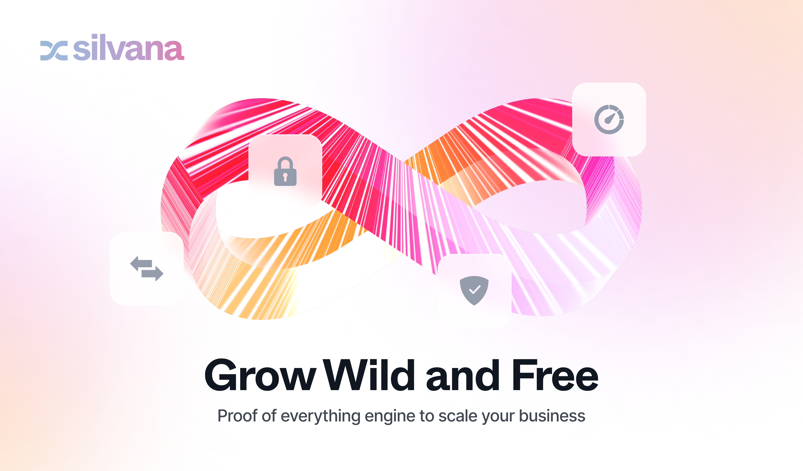

# Meet Silvana

## Introduction

**Silvana** is an ultra-fast prover engine and operational system that lets developers build and run applications across Web3 and corporate systems. 

With Silvana, both on- and off-chain business assets and data are handled as objects with provable states, enforced by cryptography and defined logic.

Every app runs as a stand-alone rollup with its own infra, powered by modular agents and orchestrated by the Coordination Layer, delivering sub-second execution with guaranteed ZK-backed finality.

## Navigation

## How Silvana Works
1. **Business logic with Lego-like modules**: use Silvana’s ready-made, add third-party ones, or create and add your own.

2. **Add Agents**: use Silvana’s, build your own, or integrate third-party to run logic, fetch, prove, and automate the operation flow.

3. **Configure your rollup** by setting coordination, data availability, settlement networks, proving system, modules, and agents, and optionally enable TEE for confidential computation and private database. Use the configuration file for this.

3. **Operate**: bring in any type of data via **standard API/SQL**, tokenize assets as **objects with provable state**, run transactions across the pipeline, and track results in **Silvascan Explorer**.

# Why Silvana?  

- **Easy onboarding and development** enables integrating modules and agents, configuring the rollup, and building apps in a few lines of code with SQL-friendly interfaces and standard APIs.  
- **Agnostic in all means** allows you to code in your language of choice, pick the proving system we support, and deploy app components to the networks that fit your needs.  
- **ZK Abstraction**: focus on building nice and powerful apps rather than wandering in the dark forest of ZK cryptography.  
- **Rollup as a service** ensures **each app is a multi-based rollup** that helps you pick the best infrastructure from the battle-tested networks available to meet your infrastructural needs.  
- **Modular, chain-agnostic architecture** that scales horizontally and works across ecosystems.  
- **Seamless coordination and automated transaction flow** through the dedicated **Coordination Layer**, automating the **transaction pipeline** – agents, proving, storage, and settlement – powered by the **Agent Network** to handle atomic tasks.  
- **Ultra-fast execution with guaranteed finality** provides lightning-fast execution with ZK proofs. The Coordination Layer runs first with the optimistic state, and settlement follows later.  
- **Bridgeless interoperability** lets you own and control native assets from where your Coordination Layer rests without a bridge and the insecurities and vulnerabilities it brings forward.  
- **Flexible deployment** adapts from cloud execution to secure enclaves (TEE), adapting to the workload and privacy needs.  
- **Layered privacy** with **ZKPs**, **MPC**, and **TEEs** working together to protect both public and private data. Pick the level of privacy you need for both **provable** and **non-provable** data. Embark on **confidential** and a **private database**.  
- **Automated key security**, powered by **Shamir Sharding** + **KMS**, ensures safe distribution and recovery of cryptographic keys.  
