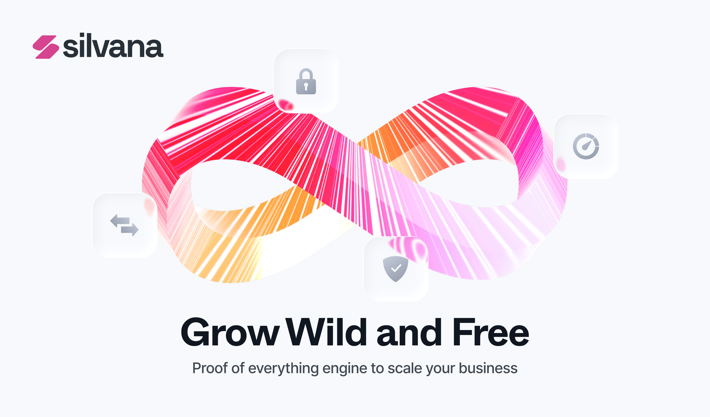

# Meet Silvana

## Introduction

Welcome to **Silvana** – a modular integration-first, composable, interoperable prover engine and operating system where users can handle both on- and off-chain business assets and data across Web3 and corporate systems – with cryptographically enforced logic and blazing-fast execution.

## What Can You Do with Silvana?

We offer a multifunctional platform using which you can:

* Prove any business data in day-to-day operations without disclosing it using zero-knowledge proofs (ZKPs);

* Bring corporate data and assets on-chain.

* Build and deploy applications as a zk rollup using agents for ease and automation;

* Implement and roll out any custom logic in plug-and-play modules;

* Effectively handle corporate assets, including tokenized real-world assets (RWAs) by bringing them on-chain;

* Execute business logic privately, in a trusted execution environment (TEE);

* Store corporate assets as provable objects in a DA or privately in own database;

* Integrate with the battle-tested on-chain infra and networks for streamlined operation.

As you can see, there are lots of nice things you can do with Silvana. Just kick in and give it a try. Grow wild and free with us!