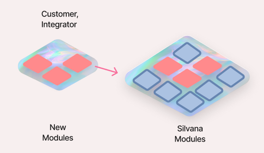

# How Apps Work

## Overview
The **Application Layer** is where the business logic in Silvana is deployed. Every client has its own business goals and requirements for which functions are developed. Most conventional L1 and L2 blockchains struggle to provide the capability to deploy custom logic due to several limitations, such as:

* Maximum field limit
* Restrictions related to the programming language
* Lack of necessary cryptographic primitives 

One of Silvana’s key characteristics is **composability**, meaning developers can deploy **any logic** using **any programming language** or cryptographic curves.

Silvana’s Application Layer has a **modular structure**. Enterprises, industry integrators and other customers deploy code in modules that are designed to meet particular business needs and provide specific business value. 

Silvana’s basic modules are open-source and can be used by anyone. They cover the most general functions that can be used in any other module and are developed and deployed by the Silvana team. Custom modules are created by various stakeholders, including businesses, industry experts, and independent developers.

:::tip Note
Essentially, a module is a piece of code in a mono repo. To use a module, a developer needs to deploy an agent. An agent assembles everything needed for a particular use case: the required modules, Prover Program, the Prover, and the Verifier Circuit.
:::

Custom modules can be open-source or restricted from public use. In the latter case, they can be either private, i.e., to be used by creators only, or for sale. Custom modules for sale are displayed in the **Silvana Marketplace** as **blueprints**.



Silvana's execution embodies the logic presented to end users on the consumer side. The Application Layer features a versatile design with distinct modules, each crafted for specific business use cases or custom functionality. Initially, these modules encompass:
* Transactions;
* NFT;
* Fungible Tokens;
* DEX;
* Name Service;
* Token Launchpad.

## Silvana Application Development
### Application Assembly Using Agents

:::tip Note
Silvana **Agents** are programmable orchestrators that bundle the necessary pieces of an application and automate its lifecycle. 
:::

In Silvana’s modular stack, an Agent acts as the glue that joins your business-specific modules with the Silvana Core components like Prover programs, Provers, Verifiers, and ABIs. Essentially, **a developer deploys an Agent to use a module** – the Agent will assemble everything needed for a given use case: the required module(s), the associated Prover Program, and the corresponding Prover and Verifier circuits. 

In this way, the Agent serves as both a wrapper and a **programmable interface** for your application, abstracting away the complexity of interacting with each layer of Silvana’s multi-layer architecture.

:::tip
An Agent’s primary role is to bridge high-level application logic (business modules) with low-level cryptographic proof generation and state verification. 
:::

Each Agent encapsulates one or more modules, and a **Prover Program** defining the rules/constraints of those modules, and coordinates the generation and validation of proofs for any state changes. This design lets developers focus on business logic while the Agent ensures all operations produce the required zero-knowledge proofs and state updates. 

In Silvana, *“Agents are not just scripts or bots”*,  they are first-class components that **bind modules**, **Prover Programs**, and **core components into coherent workflows**. 

## How Applications Work in Silvana

Silvana enables developers to rapidly deploy blockchain applications by assembling modules and managing them through specialized scripts known as Agents. This document describes the technical workflow for deploying applications on Silvana, focusing on using Agents, integrating modules, defining provable record schemas, configuring additional components, and automating transactions.

### 1. Deploying Agents

To operationalize modules into complete applications, you must deploy an **Agent**, which acts as an orchestrator. Agents are scripts that collect and coordinate several essential components:

* **Business Modules**: Functional units for tasks like transactions, NFTs, token management, decentralized exchanges, and more.
* **Zero-Knowledge Programs (Prover Program)**: Define specific cryptographic rules for validating state transitions.
* **Provers and Verifiers**: Circuits to generate and validate zero-knowledge proofs ensuring privacy and correctness.

Each Agent bundles these elements, facilitating seamless interaction between your business logic and Silvana’s cryptographic backend.

**Deploying Modules within an Agent**

Agents reference module repositories (usually monorepos hosted on GitHub) directly in their dependency configurations. Modules can be Silvana's pre-built solutions or customized by your development team to meet specific use cases.

**Prover and Verifier Integration**

Each module's logic is expressed through a Prover Program, which specifies the rules needed for state transitions. When an Agent is configured, it explicitly links each module to its corresponding Prover and Verifier components to ensure accurate proof generation and verification.

### 2. Defining Provable Record Schemas via Router
Before application execution, Provable Records must be explicitly defined in the Silvana **Router** using YAML schema definitions. These schemas describe the structure of your application's data and connect them to the appropriate Prover Program.

**Example YAML Schema**

```yaml
schemas:
  - id: "user.trading.account"
    version: 1
    fields:
      baseTokenBalance: TokenBalance
      quoteTokenBalance: TokenBalance
      bid: Order
      ask: Order
      nonce: bigint
    ProverProgramId: "trading.ProverProgram.v1"
```

This YAML schema provides a structured definition of a provable record used within an application. After defining this schema, register it with the Router using Silvana's CLI tool:

```yaml
silvana-cli schema:register -f schema.yaml
```
Once registered, the schema becomes globally discoverable, ensuring consistency across all interactions.

### 3. Configuring Additional Components

Depending on the application’s specific needs, developers might need to configure additional components within the Agent:

* **ABI Interface**: Connects modules to external systems, defining how data transactions are structured and managed.
* **State Storage and Databases**: Interfaces for storing and retrieving provable records and application data.
* **Event Handlers and Listeners**: Enables Agents to respond dynamically to events occurring within the Silvana Network or external systems.
* **Application Configuration**: Custom settings that define operational parameters like thresholds, schedules, participant addresses, and permissions.

These configurations ensure your Agent operates correctly within the wider ecosystem and meets precise business logic and workflow requirements.

### 4. Automating Transactions with Agents

Agents automate transaction execution through several methods:

**Direct Invocation**
Agents expose API endpoints that trigger transactions directly from user interactions or backend processes. For example:

```yaml
await Agent.transferTokens({ from, to, amount });
```

Upon invocation, the Agent generates a ZK proof, constructs the transaction, and submits it for settlement.

**Scheduled Execution**

Agents support cron-like scheduling to trigger transactions at specific intervals automatically:

```yaml
schedule:
  - transaction: "monthlyClose"
    cron: "0 0 1 * *"  # First day of every month at midnight
```

**Event-driven Transactions**

Agents subscribe to events from Silvana or external sources, automatically responding by executing transactions:

```javascript
Agent.on("depositConfirmed", async (event) => {
  await Agent.releaseEscrow(event.escrowId);
});
```
Event-driven mechanisms allow real-time automated responsiveness to system or external states.

### 5. Transaction Lifecycle Automation
When an Agent executes a transaction:

* **State change is initiated** via an Agent method call or event trigger.
* **ZK Prover generates cryptographic proof**, verifying compliance with predefined Prover Program rules.
* **Transaction packaged**: Proof and data encapsulated for submission.
* **Transaction submitted** automatically to **Silvana’s Coordination Layer**.
* **Settlement and verification happen automatically**, with records updated accordingly.

This lifecycle guarantees each state transition's integrity, auditability, and correctness without manual intervention.

### 6. Composing Applications with Modular Design
Silvana’s modular structure allows developers to easily combine different modules into Agents:

* **Reusability**: Use existing modules from Silvana’s library.
* **Forkability**: Modify existing modules for tailored functionality.
* **Composable Logic**: Integrate multiple modules within a single Agent to create complex application flows.

Example composition:

```javascript
import TokenModule from "@silvana/token";
import EscrowModule from "@silvana/escrow";

const agent = new Agent({ modules: [TokenModule, EscrowModule] });

agent.on("tradeExecuted", async ({ buyer, seller, amount }) => {
  await EscrowModule.releaseFunds({ buyer, seller, amount });
});
```

### 7. Monitoring and Interaction

For operational transparency and debugging, Silvana provides tools:

* **Silvascan Explorer**: Track transactions and provable record changes.

* **CLI and APIs**: Integrate management tools directly into development workflows.

**Logging and Auditability**

Agents should log essential transaction details and state changes, complementing the built-in cryptographic audit trails for comprehensive application monitoring.