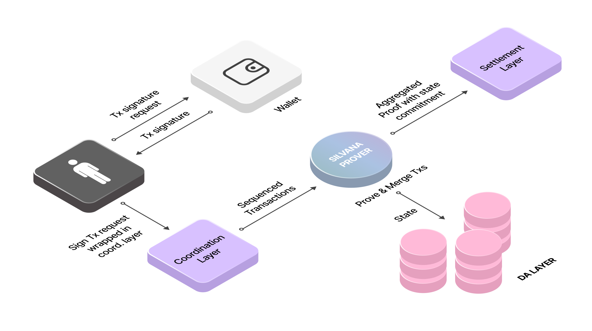

# Silvana Rollup

Silvana Rollup is built to combine high speed and strong privacy. It uses [**Zero-Knowledge Proofs (ZKPs)**](/Documentation/key-concepts/zk-proofs) to keep data secure, but ZKPs come with their own challenges — like heavy computation, complex setup, and the need to keep data available for verification. Solving these trade-offs (collectively known as the ZKP Scalability Dilemma) is key to making ZK-powered systems truly scalable.  

## Sivana’s Ultra-Fast Rollup

We created an intricately designed hybrid rollup that combines the best of two worlds: the high scalability of fast blockchains with the data security of ZK blockchains. Silvana Rollup effectively combines an optimistic rollup and a ZK rollup.

:::tip Optimistic vs. Zero-Knowledge (ZK) Rollups
Optimistic and Zero-Knowledge (ZK) rollups are both L2 scaling solutions designed to enhance blockchain efficiency by processing transactions off-chain and then submitting summaries to the main chain.​Optimistic rollups assume transactions are valid by default and rely on a challenge period to detect fraud, offering lower costs and easier integration but resulting in slower finality. In contrast, ZK rollups use cryptographic proofs to validate transactions upfront, providing faster finality and enhanced privacy, albeit with higher complexity and computational demands.
::: 

Silvana’s ultra-fast rollup comprises the **Coordination**, **Settlement**, and **Data Availability (DA) Layers**.

### Coordination Layer

Silvana’s [**Coordination Layer**](/Documentation/architecture/Layers/coordination-layer) ​is a pivotal component that orchestrates the interaction between various modules and agents within its ecosystem. Its primary function is facilitating seamless communication and synchronization among components, ensuring tasks are executed coherently and efficiently throughout Silvana’s ecosystem. More specifically, its functions extend to these:

* **Transaction Acceleration**: Silvana uses a fast L1 as the Execution Layer where transactions run, and smart contracts can be deployed.
* **Proof Aggregation**: a ZK blockchain is used as the Settlement Layer to generate aggregated (recursive proofs) that are batched in one block.
* **Sequencing**: the Coordination Layer manages the timing and sequencing of transactions, enabling features like scheduled and event-triggered transactions. This allows developers to build applications with complex, time-dependent workflows.
* **Task Coordination**: the Coordination Layer acts as a mediator between modules and agents, facilitating the flow of information and commands. It ensures that agents representing users or automated processes interact correctly with the appropriate modules, maintaining the integrity and consistency of operations across the platform.

By managing these interactions, the coordination layer facilitates efficient and secure operations, enabling developers to build complex applications without delving into the underlying cryptographic complexities.

### Settlement Layer

The [**Settlement Layer**](/Documentation/architecture/Layers/coordination-layer) in Silvana Rollup is a fundamental component that ensures the finality, integrity, and security of transactions within the network. It serves as the ultimate source of truth, maintaining an immutable and secure record of all transactional data.

### Data Availability (DA) Layer

The [**Data Availability Layer**](/Documentation/architecture/Layers/data-availability-layer) is crucial in ensuring that transaction data is accessible and verifiable by all network participants. Each time a transaction runs with a provable record (create, read, mutate, or delete), a proof is generated, and a commitment to the rollup state and the DA hash is sent to the L1 blockchain. 

1. Silvana uses **DA** to store the following:

* full rollup state, 
* history of rollup state for N blocks, 
* checkpoints, 
* proofs.

2. **L1** stores commitments to rollup state and DA hashes.

3. Silvana **Node Operators** store the following data:

* commitment to the last processed state,
* tx events containing proof data.

## Silvana Rollup Flow

A typical transaction flow in the Silvana rollup looks like this:

1. A user initiates a transaction through an application for which an Agent is called. If a wallet is used, it generates the transaction signature.
2. Transactions are sequenced in the Coordination Layer and executed.
3. Silvana Prover generates the required proofs and wraps them in a recursive (aggregated) proof.
4. The state of a provable record is recorded in the DA Layer.
5. The aggregated proof and the state commitment fall on the Settlement Layer.

## Execution Modes

Not all transactions contain private data. Such transactions don’t need proof to be generated. Then they follow a simplified transaction flow and can be processed way faster. 

The ZK circuit plays a vital role by handling its own state and maintaining the [**state commitment**](/Documentation/glossary#state-commitment) on the Coordination Layer. The ZK circuit operates in four distinct **execution modes**:

* **Submission Execution**: this mode validates input data before submission, ensuring accuracy and preventing errors from the get-go.
* **Operators Execution**: in this swift mode, multiple operators confirm the execution result by running the contract in no-proofs mode, which only takes a few milliseconds.
* **Provable Execution**: the prover within the Silvana network executes the contract and generates a proof, which is then saved to the DA layer.
* **Merge Execution**: This final mode involves merging two proofs, resulting in a recursive proof that is saved to the DA layer for further use.

## What’s So Special about Silvana Rollup?

Silvana’s Ultra-Fast Rollup is a hybrid scaling solution that operates as an optimistic rollup while integrating zk-proofs to reinforce security. This dual-layered approach ensures efficient transaction processing without compromising on cryptographic robustness. 

:::tip Key Take
On the one hand, transactions in the Silvana rollup are executed fast. On the other hand, although finality takes time, it is almost 100% ensured since it is next to impossible to impede a zk transaction since it requires tampering with proof, the possibility of which is negligible.
:::

Silvana rollup ensures security by:

* **Whitelisted operator set**: in the Silvana network, maintaining a limited set of whitelisted operators minimizes the chance of Byzantine faults and ensures 99.99% security of ZKP transactions.
* **Proof Aggregation**: every transaction is incorporated into a combined proof that no user or operator can alter by modifying the transaction data. This process ensures that the correct state is accurately reflected on L1.

## Benchmark

This is how Silvana rollup compares to other rollup types:

| Metric | Optimistic Rollups | ZK Rollups | Silvana Rollup |
|--------|-------------------|-------------|----------------|
| Throughput (TPS) | ~2,000 TPS | ~5,000-10,000 TPS | ~12,000 TPS |
| Finality Time | 7 days (fraud proof delay) | Instant after proof | Instant |
| Latency | High | Low | Ultra-low |
| Verification Cost | Low | Even lower | Minimal |
| Withdrawal Speed | Slow (fraud period) | Instant | Instant |
| Computation Overhead | Low | High | Ultra-Low |
| Security Model | Assumes all transactions are valid unless challenged (optimistic assumption) | Mathematically verified using cryptographic proofs | Hybrid security model with cryptographic proofs and economic guarantees |
| Fraud Prevention | Uses fraud proofs (requires honest watchers to dispute invalid transactions) | Uses validity proofs (ensures correctness before submission) | Hybrid model combining fraud and validity proofs for flexibility |
| Trust Model | Requires watchers to detect fraud | Fully trustless | Fully trustless |
| Censorship Resistance | Centralized sequencers can delay transactions | Similar risks, but proofs ensure correctness | Decentralized sequencers with anti-censorship mechanisms |
| Quantum Resistance | Vulnerable | STARK-based ZK-rollups are quantum-resistant | Quantum-resistant cryptographic techniques integrated |
| Proof Generation Cost | Lower | Higher | Optimized proof generation for lower costs |
| Verification Cost | Higher | Lower | Low, comparable to ZK Rollups |
| Batch Size & Compression | Moderate | Higher compression, reducing fees significantly | Advanced compression, reducing fees significantly |
| EVM Compatibility | Fully compatible with existing Ethereum smart contracts | Partial compatibility | Fully EVM-compitable |
| Developer Experience | Easy to migrate existing dApps | Requires modifications for ZK circuits | Developer-friendly with minimal changes required |
| Interoperability | Easier to integrate with other Ethereum-based chains | Harder due to cryptographic differences | Seamless Ethereum interoperability with cross-chain support |
| Privacy Features | None | Strong privacy | Enhanced privacy features with optional anonymity |
| Recursive Proofs | Not supported | Supported | Supported |
| Long-Term Viability | May face challenges with fraud-proof decentralization | Future-proof: faster, more private, quantum-resistant | Scalable with recursive proofs, parallel proving, and future upgrades, ensuring strong long-term viability. |