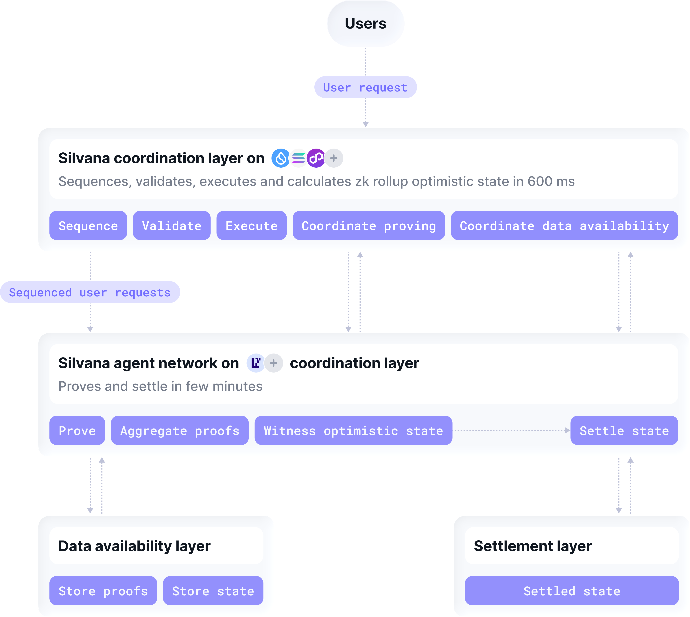
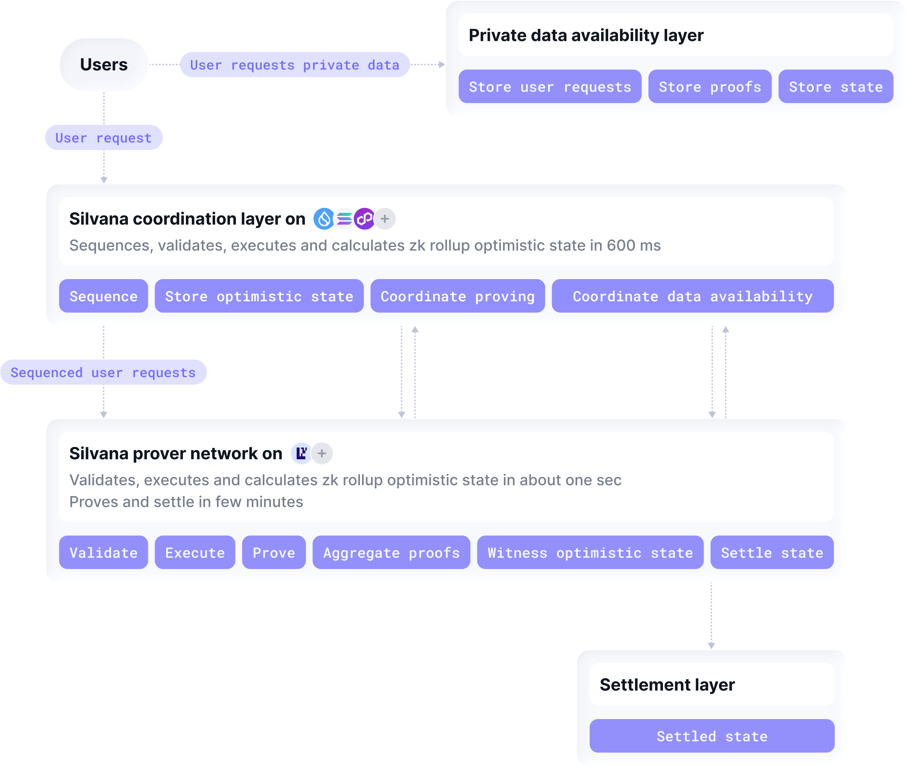
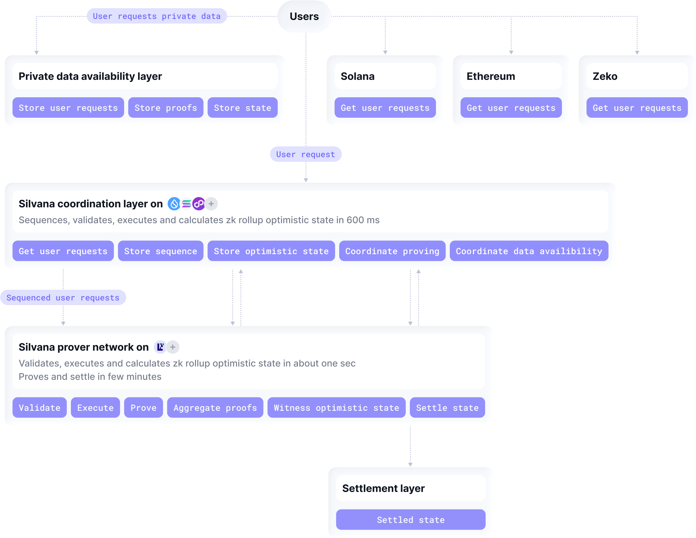

# Ultra-Rollup

## The Problem: no Perfect Rollup Out there

EVM Layer 2 solutions have long struggled to combine **speed with secure finality**. Optimistic rollups offer fast execution but weak transaction security, while zk rollups ensure strong finality through zero-knowledge proofs yet suffer from slow performance and technical complexity. Privacy-focused methods like ZKPs, MPC, and TEEs also add cost and latency.

**Silvana Ultra Rollup** solves these trade-offs – merging the speed of optimistic rollups with the proven security of zk systems to deliver a unified, high-performance, and privacy-ready architecture.

## Ultimate Solution for Ultimate Performance

Silvana’s Ultra Rollup has come up as a beacon of light, matching the **optimistic state** on a fast blockchain with the **guaranteed finality** on a settlement layer that supports ZKPs. That effectively means that you choose any blockchain for execution, and a transaction is deemed executed once the optimistic state is obtained. Later, finalization catches up on the settlement layer, and the ZKPs ensure that the chances of the transaction being tampered with are virtually zero.

What’s so special about Ultra Rollups? Bend your fingers:

1. **Lightning-fast performance**

Silvana Ultra Rollup delivers sub-second execution and proof generation, enabling instant transaction finality without compromising security or scalability.

2. **Guaranteed finality**

Finality takes more time, like with zk rollups, but it happens on a settlement network that supports ZKPs, making every confirmed transaction irreversible, verifiable, and tamper-proof.

3. **Multi-Based Rollup** 

Land your coordination layer on a network of your choice, and pick the prover system or settlement layer to match your requirements. Choose from the best to excel!

4. **Private Database and Confidential Computing**

Applications process and store sensitive business data confidentially using ZKPs, TEE, and MPC.

5. **Bridgeless Interoperability**

Manage digital assets of any network from your coordination network without bridging them;

6. **Modular Chain-Agnostic architecture**

Apps in Silvana are modular, with custom logic, modules, able plugging into different ecosystems, which ensures a high degree of developer flexibility.

7. **Easy onboarding**

You can deploy our application in a rollup using your CLI by just writing a few lines of code - nice and easy.

Voilà, those are the reasons why you should onboard on Silvana to deploy your own rollup.

## Coordination Layer for Streamlined Operation
The Coordination Layer’s job is to orchestrate the operation flow across multiple networks and organize it in a pipeline: **user request sequencing**, **transaction execution**, **proving**, and **settlement**.

1. **Request Sequencing**

Users initiate a transaction from the frontend application. There can be multiple requests, so first thing first, they must be sequenced in a queue.

2. **Execution**

Now, a transaction is built and executed. A single transaction may need more than one atomic operation to run, which happens on the Coordination Layer. Once an optimistic state is generated and  the global state is updated along with the associated objects in the DA Layer, the transaction is deemed executed, although the finalization hasn’t happened yet.

3. **Proving**

Proofs are generated for each operation within the transaction pipeline, and all of them get bundled in a recursive (aggregated) proof. That proof is recorded in the database and is accessible via the Merkle Root.

4. **Settlement**

Settlement usually catches up on a blockchain that supports ZKPs and happens later than the transaction actually runs. 

:::tip Success
The delayed settlement may pose a potential risk that the transaction can be tampered with. However, it’s not going to happen with zero-knowledge proof, as they are next to impossible to fake.
:::

Silvana Ultra is a **multi-based rollup**, meaning you can land the Coordination layer, like any other app component, on any network of your choice. Build your killer app by picking the battle-tested networks and projects out there.

How Rollups Work on Silvana
In Silvana’s Ultra Rollup, a **Network of Agents** handles all app operations, with each agent dedicated to a single task – such as proving, witnessing, data fetching, or executing functions like send or swap. 

The **Coordination Layer** orchestrates the transaction pipeline, ensuring tasks run in the correct sequence. Agents receive tasks from the Coordination Layer or other agents, allowing developers to define workflows easily by specifying task order and target networks in a simple config file.

The full operation flow and Coordination-Agent interaction looks as follows:

1. A user makes one or multiple requests from any network.
2. Coordination Layer sequences requests.
3. Coordination Layer generates optimistic states and assigns execution tasks to agents.
4. Agents witness optimistic states and execute tasks.
5. Prover agent generates proofs and aggregates them in a single recursive proof; Coordination Layer coordinates proving.
6. Agents update states and record states and proofs in the DA Layer; Coordination Layer coordinates DA operations.
7. Coordination Layer verifies proofs.
8. Agents run settlement transactions and lay settled states on the Settlement Layer; Coordination Layer coordinates Settlement.

## Execution Modes
Apps can run in 3 modes, separately or in various combinations: **Public**, **Private**, or **Multibased** – depending on the performance, privacy, and interoperability needs.

### Public
App transactions run transparently on-chain, prioritizing speed, scalability, and openness. It’s ideal for DeFi protocols, marketplaces, and other use cases where visibility and composability are key.

Deploying in the public mode exposes calldata and proofs directly to the network. Developers gain instant composability with existing ecosystems and full traceability of every state change from sequencing through settlement.

### Private
Private mode leverages privacy-preserving technologies such as Zero-Knowledge Proofs (ZKPs), Multi-Party Computation (MPC), or Trusted Execution Environments (TEEs) to protect sensitive data and logic. It’s used for enterprise, financial, or healthcare applications requiring confidentiality.

Sensitive inputs stay inside a dedicated Private Data Availability layer while only encrypted state commitments hit the chain. Business logic runs in a TEE-backed prover network, so teams get the same sub-second execution and on-chain finality – without ever exposing private fields.

### Multibased
Multibased mode allows an app to operate across multiple chains or environments simultaneously – combining the openness of public systems with the privacy or compliance of private ones. This hybrid setup enables secure cross-domain workflows, like executing private transactions while anchoring proofs publicly for auditability.

Requests can originate from several blockchains at once. The Coordination Layer batches every input in a single block, and a unified aggregated proof finalises the updated state – no bridges, shards, or extra middleware required.

