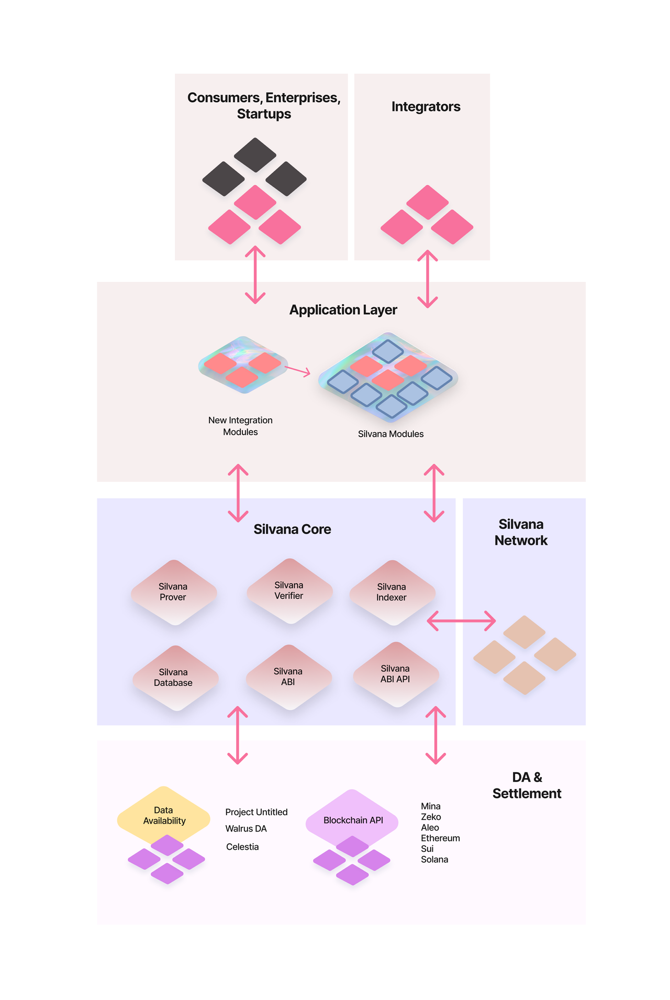
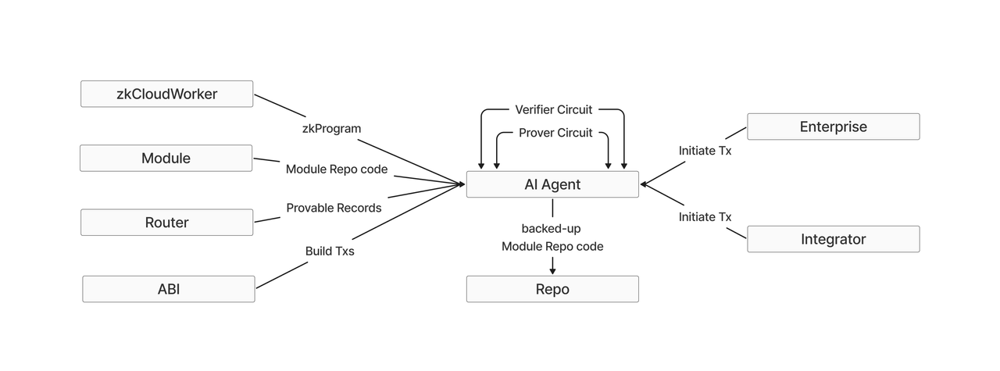

# Silvana Architecture Layers

## Settlement Layer

The Settlement Layer handles consensus, where transactions with provable records must be validated by a validator set on L1 or L2 solutions supporting ZKP technology, including:

- Mina
- Zeko
- Aleo
- Ethereum
- Sui
- Solana

## Silvana Core

This layer is where the Silvana magic happens, consisting of:

### Prover

Generates ZK proofs for mutated states of provable records

### Verifier

Checks generated proofs on the verifier's (counterparty's) side

### Router

Interface for users to interact with provable records, including public schemas showing record mutable states. Links data providers with customers, intermediaries, employees and users.

### Database

Storage for provable records

### ABI & API

- ABI handles transaction building
- ABI API shares transaction data with clients

## Silvana Network

A decentralized network of proof-generating nodes with rewards for provers, given the substantial CPU requirements.

## Application Layer

The execution layer representing business logic for end users through modular design:

### Initial Modules

- Transactions
- NFT
- Fungible Tokens
- Mina Names (name service)

Additional basic modules will be added over time. Modules are deployed as accessible code in a mono repo. Customers and integrators can add custom modules to extend functionality.

## Execution Environments

### Private Execution Environment (PXE)

- Local deployment of Silvana modules and Prover
- Local proof calculation and program execution
- On-device or local cloud deployment

### Cloud Execution Environment (CXE)

- Access to Silvana modules and core functions in public cloud

### Trusted Execution Environment (TEE)

- Secure cloud enclave with limited user access
- Protection from third parties and unauthorized insiders

## Integration Layer

End users can integrate through:

- Direct application layer access
- API integration
- System integrators specializing in specific domains

## Silvana Agents

AI agents enable automated interaction with Silvana modules and Core, providing:

### Key Features

- Account abstraction with built-in user signatures
- Scheduled transactions
- Pre-paid transactions
- Event-triggered transactions for event-based architecture

### Agent Operation

1. Makes copy of module repo
2. Uses module code and ABI for transactions
3. Accesses zkProgram for proof rules
4. Utilizes Prover and Verifier functions
5. Can deploy via PXE, CXE, or TEE

### Agent Types

#### Data Layer Agents

- Secure decentralized data storage and management
- Ensures data integrity and availability
- Handles encrypted data distribution

#### Proof Processing Agents

- Performs automated cryptographic verification
- Delivers high-certainty proofs
- Minimizes need for human intervention

### Extended Marketplace Agents

#### ZKML Agents

- Enables zero-knowledge machine learning
- Provides data insights while preserving privacy
- Processes encrypted data for analysis

#### AI Agents

- Operates in secure enclaves or as standard modules
- Generates insights from encrypted data
- Produces additional data interpretations

#### Human Agents

- Performs manual verification and checks
- Conducts audits of processes
- Provides expert oversight

#### Professional Agents

- Domain experts in finance, insurance, accounting
- Adds authoritative validation to marketplace proofs
- Ensures compliance with industry standards
