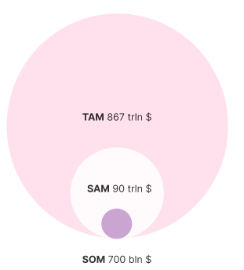

# Market Potential for Silvana

According to Chainlink, real-world assets (RWAs) are projected to be worth $867 trillion in 2024. Meanwhile, the total crypto market cap for 2024 is estimated to be around $3.5 trillion. This suggests that the ZK and blockchain technology market could be approximately 230 times larger than the existing crypto market, unveiling vast growth prospects. Additionally, the total capitalization of all tokenized assets, including stablecoins, is about $15 billion, indicating a potential market growth of roughly 57,800 times.

## Opportunity for the Blockchain Industry

Silvana enhances the broader blockchain ecosystem by introducing a provable data network and an emerging network of provers, or "prove workers" utilizing secure enclave calculations. This innovation opens new markets for ZK proof generation and distributed data handling, driving demand for integration services, staking operations, and cryptographic tools.

## Market Size

- **TAM (Total Addressable Market)**: 867 trillion USD
- **SAM (Serviceable Addressable Market)**: 90 trillion USD
- **SOM (Serviceable Obtainable Market)**: 700 billion USD

## Market Segment Sizes

The first markets we're planning to target include:

### Global Reinsurance: >$300B

- Constrained by confidentiality and compliance overhead
- Ripe for zero-knowledge-based solutions

### Global Accounting & Audit: >$500B

- Plagued by inefficiencies
- Manual reconciliation and data duplication issues

### Additional Markets

Supply Chain, Healthcare, Logistics, and Beyond:

- Countless verticals need privacy-preserving verification
- Trustless collaboration opportunities

By offering trustless, privacy-centric technology that fits existing business processes, Silvana targets these massive markets to help reduce costs, ensure compliance, and enable real-time operations.

