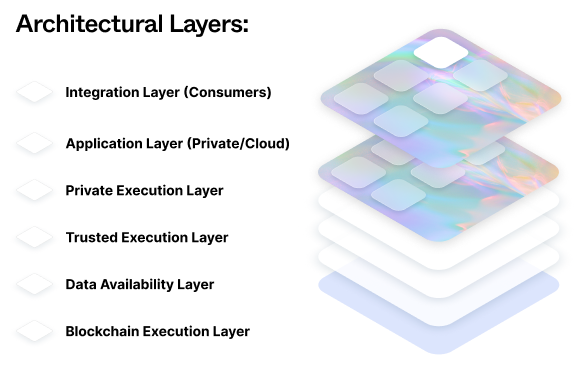
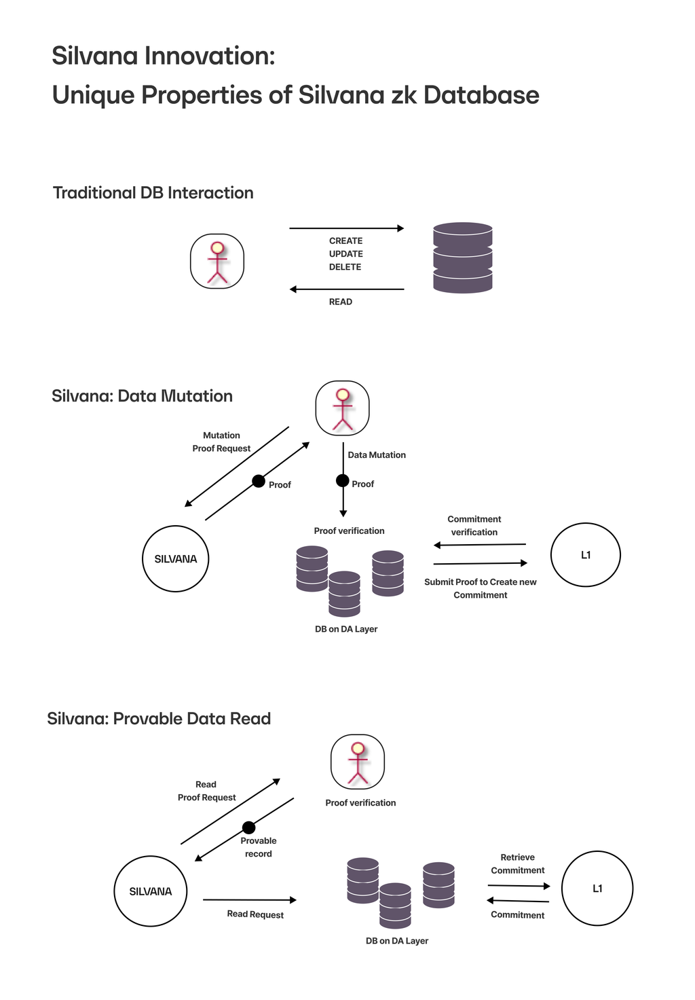

# The Silvana Solution

## Core Components

### Settlement Layer, Consensus Layer, and Proof System

Silvana leverages existing proven solutions for these fundamental blockchain components, integrating them seamlessly into our platform rather than rebuilding them from scratch.

### Zero-Knowledge Proof Engine

Our platform utilizes zero-knowledge proofs to ensure integrity of provable records while maintaining privacy:

- Keeps private information hidden
- Maintains transparency of public information
- Generates proofs for authenticity, compliance, and ownership without revealing underlying data

### Provable Records

- NFT-like on-chain objects representing business assets
- Automatic state updates based on event-driven triggers
- Cryptographically verifiable data calculations
- Protection against tampering and false reporting

### Event-Based Architecture

- **Real-Time Updates**: Instant capture of financial/operational events
- **Standard Interfaces**: Familiar REST APIs and SQL queries

## Key Technology Components

### Mina Protocol Integration

Ultra-lightweight layer for ZK-proof generation

### DA and Mutable State Layers

- Decentralized data availability with staking
- Minimal on-chain overhead
- Robust data accessibility even if central servers fail

### Trusted Execution Environment (TEE)

- Enhanced privacy and security for sensitive computations
- Shielded private inputs

### Cross-Chain Compatibility

- Blockchain-agnostic design
- Support for multiple protocols (SUI, Walrus, etc.)
- ZK proof processing and verification across chains

### Hidden Complexity

- Abstracted ZK and chain operations
- Business-focused interface showing only relevant data
- Cryptographic verification of correctness and privacy

## Architecture

Silvana's platform consists of 4 primary layers:

### 1. TEE - Trusted Execution Environment

- Enterprise proof generation environment
- Business rule-based ZkProgram logic definition
- Backend smart contract implementation

### 2. PEE - Private Execution Environment

- Optional customer-provided backend
- Support for enterprise-side proof generation
- Customer-side proof verification

### 3. Application Layer

Features:

- Modular building blocks (NFT, Transfer, Auction, Escrow)
- Standard REST APIs and SQL interfaces
- Chain-agnostic design
- Integration options:
  - Direct module integration
  - Industry integrator connection

### 4. Blockchain Execution Layer

- Transaction execution and recording
- Provable record management
- Proof generation and verification

## Data Availability Layer

The DA layer provides critical data storage and management:

### Key Features

- Blob-based data storage
- Proof of data availability
- CRUD operations support

### Storage Options Comparison

| Option              | Description                           |
| ------------------- | ------------------------------------- |
| Private Database    | Controlled access storage             |
| Public DA Layer     | Open data storage                     |
| Encrypted Public DA | Private data on public infrastructure |
| Gated DA Layer      | Access-controlled private storage     |

### Benchmark Comparison

| Aspect                              | Private DB                                                                                                                                                                     | Public Data in a Public DA Layer                                                                                                                                           | Private Data in a Public DA Layer                                                                                                                                                                                                                                                                     | Private Data on a Private DA Layer                                                                                                                                                                                                                                                        |
| ----------------------------------- | ------------------------------------------------------------------------------------------------------------------------------------------------------------------------------ | -------------------------------------------------------------------------------------------------------------------------------------------------------------------------- | ----------------------------------------------------------------------------------------------------------------------------------------------------------------------------------------------------------------------------------------------------------------------------------------------------- | ----------------------------------------------------------------------------------------------------------------------------------------------------------------------------------------------------------------------------------------------------------------------------------------- |
| Overall Performance                 | Offers strong control and performance but relies on centralized trust.                                                                                                         | Guarantees maximum transparency and availability; no inherent privacy, which may demand extra masking techniques for sensitive inputs in ZK proofs.                        | Attempts to achieve privacy while leveraging public availability but is risky—if encryption or key management fails, the entire system can be compromised. This is why it's often viewed as a "bad solution" for truly sensitive data.                                                                | Leverages the benefits of decentralized data availability while enforcing access restrictions, making it a robust option for generating ZK proofs that require both verifiability and confidentiality, though it comes with increased management overhead.                                |
| Privacy and Access Control          | Data is stored in a controlled environment with strict access policies                                                                                                         | Data is fully public and transparent                                                                                                                                       | Data is encrypted before being published, attempting to keep it private while being stored on a public network                                                                                                                                                                                        | Combines the accessibility benefits of a DA Layer with selective, permissioned access; only authorized participants can retrieve or verify data, offering a strong privacy guarantee.                                                                                                     |
| Trust and Security                  | Trust is placed in the operator or owner of the database; centralization can be a single point of failure if not designed with redundancy.                                     | Offers trustless verification since anyone can access and validate data; doesn't ensure privacy for sensitive information                                                  | Relies on the proper implementation of cryptography and key management; the encrypted format might seem secure but introduces complications.                                                                                                                                                          | Reduces the risk of uncontrolled exposure while still enabling decentralized verification among selected parties; requires robust governance and access control mechanisms.                                                                                                               |
| Data Availability and Performance   | Typically offers high-performance access but might require significant infrastructure management                                                                               | Public networks are typically designed for high availability and scalability                                                                                               | Benefits from the high availability and decentralization of public networks, but encryption/decryption can add overhead                                                                                                                                                                               | Can be engineered to offer a good balance of availability and performance while ensuring controlled access                                                                                                                                                                                |
| Suitability for ZK Proof Generation | Ideal if the proof generation process occurs in a trusted, internal context; however, the centralization may conflict with the trustless ideals common in many ZK applications | While verifiable data is advantageous for some aspects of ZK, the lack of privacy may force additional layers of abstraction or obfuscation if sensitive inputs are needed | May introduce challenges for verification: encrypted data must be decrypted or proven correct in a zero-knowledge manner; often criticized (as in some Aleo models) due to potential key management issues, exposure risks, and limitations in proof validity if the underlying cryptography weakens. | Provides a strong middle ground by allowing verifiable (and even decentralized) data availability without exposing sensitive information publicly; particularly useful when ZK proofs need to reference off-chain data that must remain confidential to a trusted subset of participants. |

### Provable Database Transactions

What's special about the DA arrangements with Silvana is provable DB transactions meaning everytime a user calls the DA layer to read, write, delete, or update a provable record, Silvana generates proof for that, which means provable read and provable mutation of data.

#### Traditional DB

With a traditional DB interaction pattern, a user runs a DB transaction without any proof being generated.

#### Silvana Provable Data Mutation

With Silvana, each time data about a provable record is mutated, proof is generated. Then, the data mutation flow looks as follows:

1. A user makes a data mutation proof request in Silvana.
2. Silvana Prover generates proof.
3. The user verifies the proof.
4. The database on the DA Layer submits the proof to L1 to create a new commitment.
5. The commitment is verified.
6. The data about the provable record is mutated.

#### Silvana Provable Data Reading

Whenever a user reads data in the DA Layer, Silvana generates proof. Now, the flow for proved data read looks like this:

1. A user makes a data read proof request in Silvana.
2. Silvana prover generates proof.
3. The user verifies the proof.
4. The database on the DA Layer submits the proof to L1 to create a new commitment.
5. The commitment is verified.
6. The user can read the data.

The diagram below illustrates DB interaction arrangements with Silvana.

