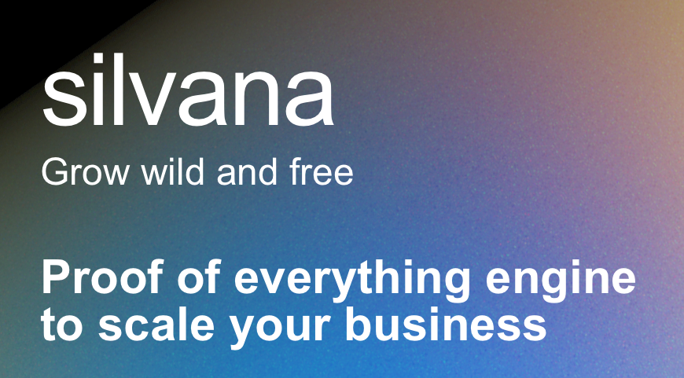

# Silvana Documentation

Welcome to Silvana, a revolutionary platform that transforms how businesses handle trust, compliance, and efficiency challenges in the global marketplace.

## What is Silvana?

Silvana is a next-generation platform that combines zero-knowledge (ZK) proofs with an innovative object-centric blockchain design. Our platform enables enterprises to:

- **Prove Without Revealing**: Verify claims and demonstrate compliance while keeping sensitive data private
- **Seamless Integration**: Connect to existing systems through familiar REST APIs and SQL interfaces
- **Enterprise-Ready**: Bridge the gap between corporate finance IT systems and advanced cryptography

## Key Features

### Zero-Knowledge Proofs

Leverage the power of ZK technology without dealing with its complexity. Silvana handles the cryptographic heavy lifting behind the scenes, allowing you to focus on your business logic.

### Object-Centric Blockchain

Our unique blockchain architecture is designed specifically for enterprise use cases, providing:

- Enhanced data organization
- Improved scalability
- Better alignment with business processes

### Easy Integration

Despite its sophisticated technology stack, Silvana offers straightforward integration options:

- REST API endpoints
- SQL interfaces
- Compatible with existing IT infrastructure

## Getting Started

Ready to explore Silvana? Continue reading our documentation to learn how to:

- Set up your first Silvana instance
- Integrate with your existing systems
- Implement zero-knowledge proofs in your business processes
